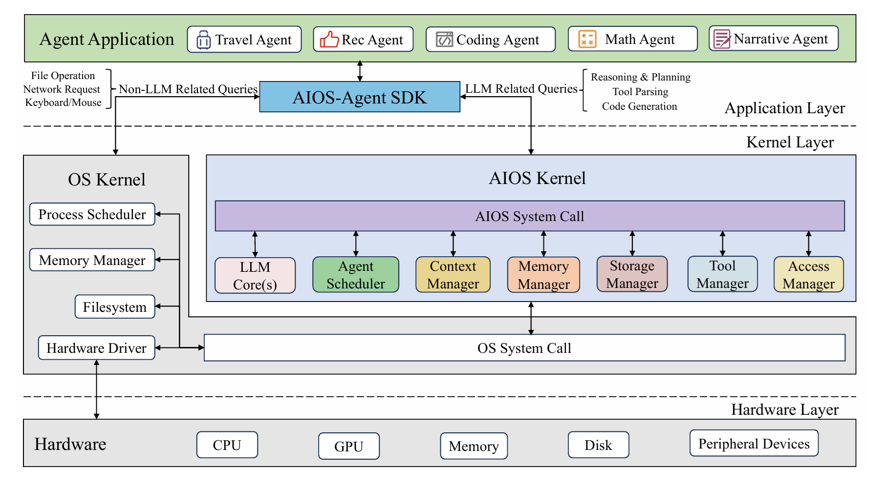
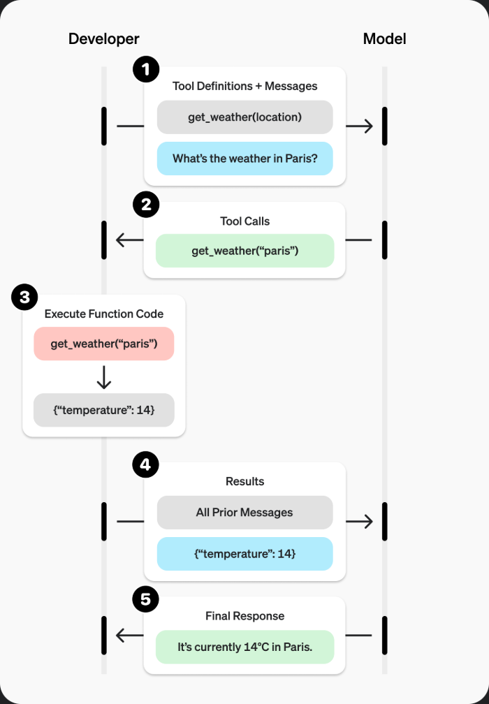

# 可行性报告

## 项目介绍

## 创新点

往年有数个小组均选择了以 LLM+文件系统 作为大作业的内容。

ArkFS 利用 LLM 技术实现了从自然语言（包括语音）到文件操作任务序列的转换，得以让用户用简单的自然语言甚至语音描述实现文件系统的增删改查。但 ArkFS 使用的结构仍为传统的 RAG 查询。我们认为将其架构改为更优的 GraphRAG，有利于进一步提升文件之间的语义关联性，提高查询的准确性，更好地处理复杂关系查询任务。

vivo50 虽然能够实现多模态数据的向量化统一整理，可以将分布式存储的文件与 tag 的关系清晰呈现在 Neo4j 数据库中，以根据用户输入进行高效查询，但其在图结构上有一定缺陷，仅仅建立了文件和 tag 之间的映射，实际上退化成了二分图的形式，弱化了各类文件中对象、概念之间的关联。我们认为将由 tag 和文件构成的二分图优化为由对象、概念、关系及对应的文件构成的知识图谱结构，能提高图文件系统结构的合理性，优化查询的效率。

MyGlow 在往年项目基础上重新搭建了整个分布式框架，优化了数据的一致性，提高了图文件系统的鲁棒性，并部署了监控系统以应对突发情况。该项目对文件图结构的整理原理在于引入了对 Ray 打标的大模型。我们希望用 Llama Index 等更新的框架统一格式序列化文档、知识，并用 GraphRAG 的框架对文件中的对象、关系进行整理，在打标的基础上做了进一步的优化。

综上，与往年项目与现有工业界成果相比，我们项目的创新点在于：

1.  **深度语义理解驱动的文件管理:**

- 超越关键字和元数据： 不同于传统基于文件名、路径、固定标签或简单关键字提取的方法，IOSYS 利用 LLM 对文件内容进行深层语义理解，能够基于文件的真实含义、主题、实体、关系等进行组织和检索。
- 自然语言成为一级交互界面： 将自然语言交互提升为文件系统的核心操作方式，用户可以用日常语言完成复杂的文件查找、分类、关联、摘要甚至内容生成等任务，极大提升易用性和效率。

2.  **图状文件组织范式:**

- 图能够编码大量的异构和关系信息，很契合众多现实世界应用，这也符合我们预期中文件系统的特征。与以往基于存储位置组织文件的形式相比，图的结构能更准确地表示文件之间的相似特征与依赖关系。
- 基于图的文件系统允许为文件附加多维度的语义标签，支持多对多的关系映射。这种灵活性使用户能够根据不同的语义维度对文件进行分类和检索，超越了传统树状结构的单一分类方式，提供了更直观和多样化的文件组织方式。

3.  **全面的语义信息集成:**

- 区别于仅关注文件内容或标签的单一语义维度方法，IOSYS 旨在集成文件系统各个方面的语义信息（可能包括文件内容、元数据、文件间关系、用户交互历史等），构建更全面、立体的文件语义理解模型，从而提供更智能、更精准的文件管理服务。
- Graph RAG 构建的知识图谱不仅能把文件本身映射至高维空间，还可以将文件的关系、交互等信息一并送入嵌入模型。在做到更细、更小地切割数据颗粒度的同时，LLM 可以从现有的知识图谱中进行上下文学习，与其他索引结合使用，做到更全面的语义信息集成，提高知识的利用效率。

## 理论依据

### 语义文件系统 (Semantic File Systems)

- 自 Gifford 等人（[gifford1991semantic](https://web.mit.edu/6.826/archive/S97/13-Gifford-Semantic-file-systems-paper.pdf)）提出语义文件系统 (他们为这个语义文件系统引入了一个层，该层通过从文件中提取属性来生成目录，使用户能够更便捷得通过导航查询文件属性) 概念以来，学界一直在探索如何超越基于关键字和固定元数据的传统文件管理模式，转向基于文件内容和属性的、更符合人类认知的组织与检索方式。

- 早期工作（如 Bloehdorn（[bloehdorn2006tagfs](https://www.researchgate.net/publication/240789787_TagFS_Tag_Semantics_for_Hierarchical_File_Systems)）、Schandl（[schandl2009sile](https://link.springer.com/chapter/10.1007/978-3-642-02121-3_8)）等）验证了利用语义信息（如自动提取属性、标签）改进文件管理的潜力，但受限于当时的技术，语义提取和理解的深度与广度有限。

- iosys 继承了语义文件系统的核心思想，即**通过理解内容的“意义”来管理文件**，但借助 LLM 这一革命性工具，有希望能突破早期系统在语义理解深度、灵活性和自动化程度上的瓶颈，将理论设想推向更实用的阶段。

### 语义解析 (Semantic Parsing)

- 将用户自然语言指令转化为机器可执行操作是人机交互的关键，语义解析研究长期致力于此。传统方法（如基于规则、统计模型、早期神经网络）在处理复杂、模糊、未曾见过的自然语言指令时面临挑战，且往往需要专门的训练数据。
- 如今出现的 LLM 具备前所未有的**自然语言理解和生成能力**，能够直接理解用户的意图，并按需生成结构化输出（如特定格式的命令、API 调用参数等），极大地简化了语义解析的实现路径。
- 利用 LLM 作为核心实现**自然语言接口和指令转换引擎**，理论上可以支持更灵活、更强大的自然语言文件操作指令，降低用户的使用门槛，提升交互的自然度和效率。

### AIOS 架构

AIOS 并非完全空想,实际上研究人员已经提出了多种 AIOS 架构设计思路，例如:



它大体上被分为三层:

1. **应用层 (Application Layer):**

- **Agent Application:** 包含了各种具体的 AI 智能体应用。图中示例包括：旅行 Agent、推荐 Agent、编码 Agent 等。这些 Agent 都是是面向特定任务或领域的专用智能体.
- **AIOS-Agent SDK (Software Development Kit):** 这是一个关键的中间件/接口层。它直接服务于上层的 Agent 应用。其主要作用是：接收来自 Agent 应用的请求以及区分请求类型：

2. **内核层 (Kernel Layer):**

- 这一层是系统的核心，包含了两个并行的内核组件：传统的 OS 内核和专门的 AIOS 内核。
- **OS Kernel (操作系统内核):**
  - 包含标准操作系统的核心组件：进程调度器 (Process Scheduler)、内存管理器 (Memory Manager)、文件系统 (Filesystem)、硬件驱动 (Hardware Driver)。
  - 负责管理系统的基本资源，处理来自应用层的非 LLM 相关请求，并直接与硬件交互（通过硬件驱动）。
- **AIOS Kernel (AI 操作系统内核):**
  - 这是为 AI Agent 和 LLM 设计的专用内核。
  - **AIOS System Call:** 提供给 AIOS-Agent SDK 调用的接口，用于处理 LLM 相关的复杂任务。
  - **与 OS Kernel 的交互:** AIOS Kernel 需要通过 **OS System Call** 接口与底层的 OS Kernel 交互，以获取硬件资源(如通过 OS 内存管理器分配内存，通过文件系统读写磁盘等).

3. **硬件层 (Hardware Layer):**

- 这是最底层，包含系统的物理硬件资源: CPU 、GPU、Memory、Disk、Peripheral Devices.
- 硬件资源由内核层（主要是 OS Kernel 的 Hardware Driver）进行管理和抽象。

## 技术依据

### Tool & Function Calling

#### 简介

Tool calls 也叫 function calls，是大模型操作外部工具的一种方式。它允许模型在生成响应时调用外部 API 或函数，以便获取额外的信息或执行特定的操作。通过这种方式，模型可以更好地处理复杂的任务，提供更准确和实用的答案。

对于 iosys 来说，tool calling 也是 LLM 操作文件系统的接口。



#### 通过 OpenAI SDK 调用

OpenAI SDK 支持 tool calling。以下是提供 LLM 调用天气信息获取工具的示例[^1]：

```python
from openai import OpenAI

client = OpenAI()

tools = [{
  "type": "function",
  "function": {
    "name": "get_weather",
    "description": "Get current temperature for a given location.",
    "parameters": {
      "type": "object",
      "properties": {
        "location": {
          "type": "string",
          "description": "City and country e.g. Bogotá, Colombia"
        }
      },
      "required": [
        "location"
      ],
      "additionalProperties": False
    },
    "strict": True
  }
}]

completion = client.chat.completions.create(
  model="gpt-4o",
  messages=[{"role": "user", "content": "What is the weather like in Paris today?"}],
  tools=tools
)
```

预期可以得到如下的结果：

```json
// print(completion.choices[0].message.tool_calls)
[
  {
    "id": "call_12345xyz",
    "type": "function",
    "function": {
      "name": "get_weather",
      "arguments": "{\"location\":\"Paris, France\"}"
    }
  }
]
```

#### 模型支持

大部分大模型都支持 tool calling，包括 GPT-4o, Gemini Flash 2.0, DeepSeek V3/R1 等。

#### 指令生成

Tool calling 除了用来让模型调用工具以获取信息以外，也可以用来让模型生成指令。这是 tool calling 在 iosys 中的一个重要用途。

我们可以定义多个用于操作文件的工具，并让模型根据用户的输入生成相应的指令。比如：

- 创建/读取/修改/删除文件
- 关联/取消关联文件
- ...

通过这种方式，就可以通过 LLM 来操作文件系统。

### LLM 对复杂文件格式的处理能力:
  - 现代 LLM 服务（如 OpenAI API）已具备处理一些非纯文本文件格式（以 PDF 为例）的能力，这为 iosys 理解和管理多样化文件内容提供了关键技术支撑。
  - 其实现机制通常结合了**文本提取**和**页面图像分析**。通过将提取出的文本和每页的图像同时输入给具备视觉能力的模型，LLM 可以综合理解文本信息和图表、布局等视觉元素中包含的关键信息。
  - 提供了灵活的文件输入方式，如**预先上传文件获取 ID** 或 **直接在请求中发送 Base64 编码的文件数据**，这使得 iosys 在架构上可以方便地集成文件内容到 LLM 的处理流程中。
  - 虽然存在更多的 token 消耗、文件大小/页数限制以及需要特定多模态模型支持等实际考量，但这明确证明了**技术上存在让 LLM "读懂"并分析 PDF 等常见复杂文档内容的可行路径**。
  - 这项能力极大地扩展了 iosys 的适用范围。它不再局限于处理简单的文本文件，而是有潜力对包含图文报告、演示文稿、扫描文档等的 PDF 文件进行深度的语义理解、摘要、查询和组织，显著提升了作为一个通用文件管理系统的实用价值。
  以下是 openai 给出的一个 PDF 处理样例:

      ```python
      import base64
      from openai import OpenAI
      client = OpenAI()

      with open("draconomicon.pdf", "rb") as f:
          data = f.read()

      base64_string = base64.b64encode(data).decode("utf-8")

      response = client.responses.create(
          model="gpt-4o",
          input=[
              {
                  "role": "user",
                  "content": [
                      {
                          "type": "input_file",
                          "filename": "draconomicon.pdf",
                          "file_data": f"data:application/pdf;base64,{base64_string}",
                      },
                      {
                          "type": "input_text",
                          "text": "What is the first dragon in the book?",
                      },
                  ],
              },
          ]
      )

      print(response.output_text)
      ```

### 用于语义理解的向量嵌入 (Vector Embeddings) 和向量数据库 (Vector Databases):
  - **核心机制:** IOSYS 实现语义能力的一个基础技术是使用**向量嵌入**。这是由专门的 AI 模型生成的文本字符串（如文件内容、摘要或用户查询）的数值向量表示（浮点数列表）。其关键原理在于**两个向量之间的距离衡量了它们的语义相关性**——距离小意味着含义高度相似，距离大则表示相关性低。
  - **可用性与模型:** 一部分 AI 平台通过 API 端点提供了强大且高效的**嵌入模型**（例如 `text-embedding-3-small`）。可以通过以下方式调用 API 获取嵌入：

      ```python
      from openai import OpenAI
      client = OpenAI()

      response = client.embeddings.create(
          input="Your text string goes here",  # 需要转换的文本
          model="text-embedding-3-small"     # 指定嵌入模型
      )

      embedding_vector = response.data[0].embedding # 提取嵌入向量
      # print(embedding_vector) # 输出向量，是一长串浮点数
      ```
      这些模型接收文本输入，并输出高维度的嵌入向量（例如，`text-embedding-3-small` 默认 1536 维，`text-embedding-3-large` 默认 3072 维，并可能支持通过 `dimensions` 参数进行缩减）。使用最新的、性能优越的模型可以确保更好的语义捕捉能力和潜在的成本效益。
  - **API 响应结构:** API 返回的响应包含嵌入向量以及一些元数据，其结构示例如下：

      ```json
      {
        "object": "list",
        "data": [
          {
            "object": "embedding",
            "index": 0,
            "embedding": [  // 这就是实际的嵌入向量（浮点数列表）
              -0.006929283495992422,
              -0.005336422007530928,
              -4.547132266452536e-05,
              -0.024047505110502243
              // ... 更多浮点数
            ]
          }
        ],
        "model": "text-embedding-3-small", // 使用的模型
        "usage": { // Token 使用情况
          "prompt_tokens": 5,
          "total_tokens": 5
        }
      }
      ```
  - **赋能语义搜索与组织:** 对 iosys 而言，这项技术十分有意义。通过将文件内容（或相关片段/摘要）转换为嵌入向量，系统能够：
      *   执行**语义搜索**: 不再仅仅依赖关键词，IOSYS 可以找到其内容向量与用户自然语言查询的嵌入向量最接近（例如，使用对于 OpenAI 提供的归一化向量而言计算高效的**余弦相似度**）的文件。这使得基于*含义*和*概念*的搜索成为可能。
      *   实现**聚类与分类**: 具有相似嵌入向量的文件可以被自动分组或分类，有助于超越传统文件夹结构的智能组织。
      *   支持**推荐**: 基于内容相似性识别相关文件或文档。
  - **通过向量数据库实现高效检索:** 为了处理可能大量的文件嵌入并在其中高效地执行相似性搜索（快速找到 K 个最近邻），这些嵌入通常被存储在专门的**向量数据库**中并建立索引。这类数据库针对高维向量运算进行了优化。
  - 强大的嵌入模型与高效的向量数据库相结合，使其能够超越表层元数据，真正理解文件的内容，从而实现其愿景中的强大语义搜索、自动化组织以及其他智能文件管理功能。

### 集成式 LLM 文件搜索与检索能力:
  - 一些 LLM 服务平台（如 OpenAI）已提供 **内置的文件搜索工具**，该工具使 LLM 能够在响应用户请求前，主动在其指定的 **文件知识库(向量存储)** 中进行信息检索。这为 iosys 实现高效、智能的文件内容查找提供了强大的技术支持。
  - 这种能力通常结合了 **语义搜索（基于含义匹配）和关键字搜索**，允许用户通过自然语言查询，让 LLM 自动在预先上传和处理（向量化）的文件集合中找到最相关的信息片段。
  - 该功能还支持返回**明确的文件引用（Citations/Annotations）**，将 LLM 生成内容中的信息溯源到具体的源文件，增强了结果的可信度和可用性。同时，提供结果数量限制、元数据过滤等**定制化选项**，允许在效率和效果之间进行权衡。
  - 这项技术说明了**将 LLM 与向量化文件检索深度集成**的可行性。它说明了存在一个经过验证的、可能可行方式去实现**自然语言语义文件搜索**的路径。用户可以用自然语言提问（“查找关于深度学习项目进展的报告”），iosys 可以利用类似机制，让 LLM 驱动后端在文件库中进行检索，并将找到的信息整合到响应或文件操作建议中，是实现 iosys 核心功能的关键技术依据之一。
  以下是 openai 给出的一个文件搜索样例:

      ```python
      response = client.responses.create(
          model="gpt-4o-mini",
          input="What is deep research by OpenAI?",
          tools=[{
              "type": "file_search",
              "vector_store_ids": ["<vector_store_id>"],
              "filters": {
                  "type": "eq",
                  "key": "type",
                  "value": "blog"
              }
          }]
      )
      print(response)
      ```

### 提示工程 (Prompt Engineering):
  - 与 LLM 的有效交互严重依赖于如何设计输入提示（Prompts）。提示工程作为一项关键技术，能够让我们**精确地引导和约束 LLM 的行为**。
  - 在 iosys 中，提示工程将用于：
      - 将用户的自然语言查询（可能模糊或不完整）**转化为清晰、明确的任务指令**，供 LLM 理解和执行。
      - 指示 LLM **针对文件内容执行特定分析**，如摘要、关键词提取、关系识别等。
      - 要求 LLM **以特定的结构化格式（如 JSON）输出结果**，便于后续程序解析和执行具体的文件系统操作（如生成文件列表、操作指令、元数据标签等）。
      - **实现复杂任务的分解**，通过一系列精心设计的提示链（Prompt Chaining）或 ReAct (Reasoning and Acting) 模式，引导 LLM 完成多步骤的文件管理任务。
  - 成熟的提示工程技术和不断发展的最佳实践，为 iosys 利用 LLM 实现其核心功能提供了必要的技术手段，确保 LLM 能够可靠、可控地服务于文件系统的需求。

## 技术路线

## 参考文献

[^1]: https://platform.openai.com/docs/guides/function-calling
