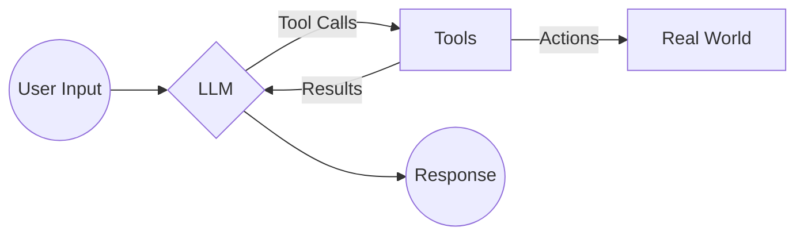
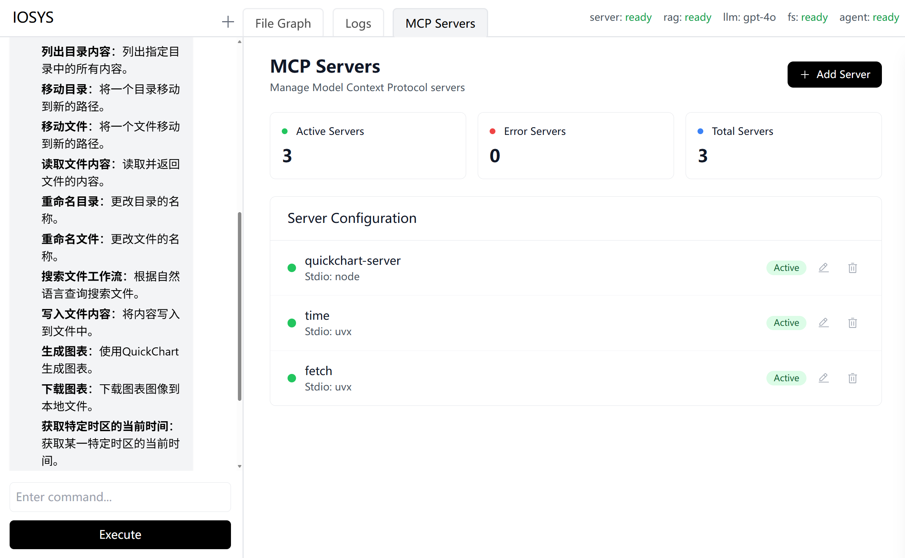
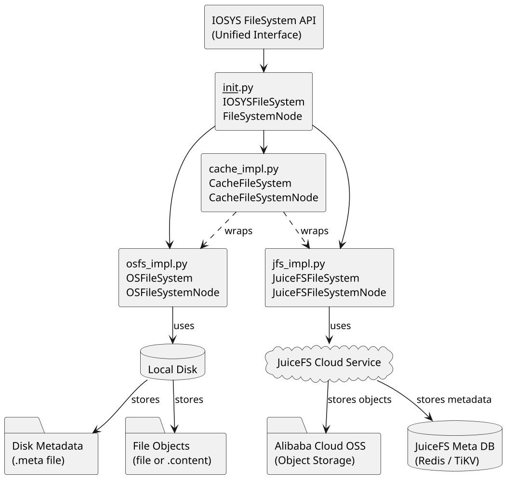
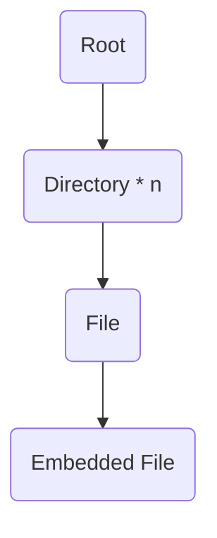
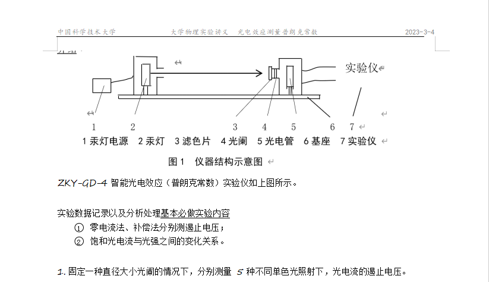
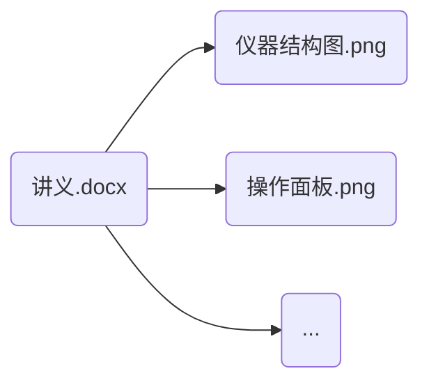
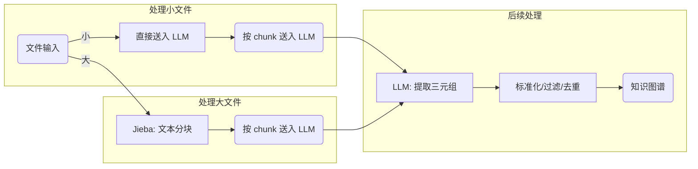
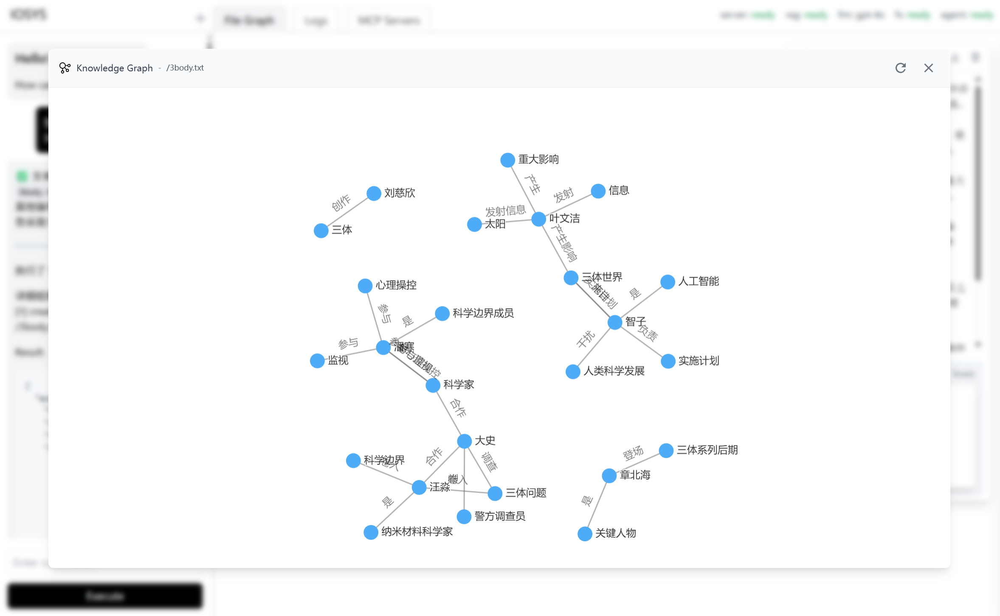
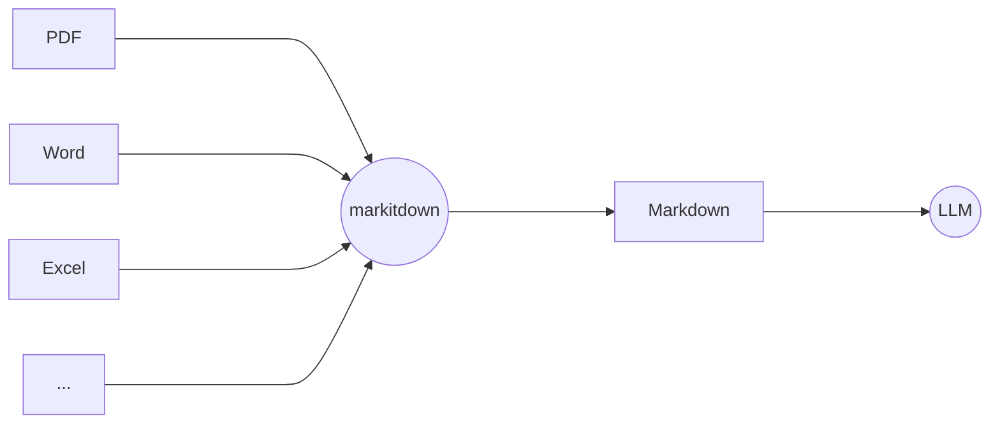

# Team IOSYS

<div class="text-4 op-80">

熊桐睿 张海川 朱雨田 许逸凡 冉竣宇 徐铭凯

</div>

---
zoom: 0.85
---

Why{.sect}

## 往年项目

- [My-Glow (2023)](https://github.com/OSH-2023/My-Glow) 基于 [Wowkiddy (2022)](https://github.com/OSH-2022/x-WowKiddy) 和 [TOBEDONE (2022)](https://github.com/OSH-2022/x-TOBEDONE) 

  ✅ 分布式框架优化、鲁棒性监控 <br>
  ⚠️ 传统打标方法 [✨ LlamaIndex]{.float-right.mr-50}

- [ArkFS (2024)](https://github.com/OSH-2024/ArkFS)

  ✅ 多模态向量化、二分图映射 <br>
  ⚠️ 图结构简化 [✨ 知识图谱]{.float-right.mr-50}

- [vivo50 (2024)](https://github.com/OSH-2024/vivo50)

  ✅ 自然语言/语音交互、任务序列转换 <br>
  ⚠️ RAG架构限制 [✨ Tool call]{.float-right.mr-50}

<div v-drag="[389,168,310,282]" border="3 yellow-500 dashed rounded-xl" pt-1 pl-2 text-yellow-600>
我们的改进
</div>

---
zoom: 0.85
---

Why{.sect}

## The [AIOS]{.text-4xl} [Trend]{.text-primary}

<div flex justify-center>

</div>

---
layout: fact
class: bg-black bg-op-10
---

## 真正的意义是什么？

为什么这些 LLM+FS 系统，都（还）没有流行起来？

<div flex justify-center items-center mt-6>
我们真的那么需要
<div inline-flex flex-col text-sm>
<div> “删除电脑中一张包含一棵树的图片” </div>
<div> “寻找我的身份证正反面照片” </div>
</div>
吗？
</div>


---

What{.sect}

### 我们要做什么

更强大的文件系统 Agent {.text-3xl.underlined.mb-4}

- 用自然语言进行文件操作
- 用图形式重新组织文件
- 提升增删查改等操作的效率

---
zoom: 0.85
---

What{.sect}

## 创新点

<div v-drag="[85,141,400,95]">

### 1. 深度语义理解驱动的文件管理

- 超越关键字和元数据
- 自然语言成为一级交互界面

</div>

<div v-drag="[542,201,335,127]">

### 2. 图状文件组织范式

- 编码大量的异构和关系信息
- 多维度的语义标签
- 多对多的关系映射

</div>

<div v-drag="[150,347,583,159]">

### 3. 全面的语义信息集成

- 集成各个方面的语义信息[（元数据、文件间关系、用户交互历史等）]{.text-sm.op-80}
- 更细粒度的数据

</div>

---

What{.sect.mt--2!}

### The Additional Capability

<div text-3xl mt-2 underlined mb-1> Agent2Agent Protocol (A2A) </div>
<div italic text-4 op-80>(Proposed by Google, 2025.4.9)</div>


<div fixed inset-2 border="yellow 4 rounded-4" />

<div v-drag="[458,179,308,NaN]" border="1.5 black op-70 rounded-xl" px-2 py-1>

### A2A or MCP? {.mb-2.text-primary}

- A2A: How agents collaborate
- MCP: How functions are provided
- No conflict

</div>

---



---


<FocusOn :left="340" :top="185" :radius="120" />

---

# Server & Agent

## Agent: 用户交互的枢纽

<br>

1. 处理用户请求
2. 使用 LLM 进行自然语言理解
3. 调用工具获取信息/执行操作


---

# Server & Agent

## Tool Call

LLM 调用外部工具的方式

<br>

- **获取信息**：读取文件内容 / 绘制图表
- **执行操作**：创建目录 / 生成文档

---

# Server & Agent

## Tool Call

<br>

- **多轮调用**："请总结文件 a 的内容，并将结果保存到文件 b 中"

<br>




---

# Server & Agent

## Model Context Protocol (MCP)

<br>

- 最广泛采用的 Tool Call 协议
- 自由启用 / 关闭工具
- 支持官方 JSON 格式配置文件



---

# Server & Agent

## 


---


<FocusOn :left="310" :top="355" :radius="120" />

---

# FileSystem

<br>

- 一套接口，支持两种实现
  - **OSFS**：本地文件系统
  - **JFS**：JuiceFS 分布式文件系统

- 原生支持嵌入文件

- 原生支持元数据



---

# FileSystem

## “嵌入文件”

Word 中内嵌的图片，如何体现在文件系统中？<br>

- 统一文件与目录：<span block mt--2 />
  - 目录 $=$ 文件 $-$ 内容
  - 文件 $=$ 目录 $+$ 内容

- 嵌入文件作为原文件的子节点

- 嵌入文件具有一致操作接口



---


<FocusOn :left="560" :top="375" :radius="140" />

---

# File Parser

多模态数据的**解析**、**文本化**与**概要生成**
<div h-4 />

- 文本化功能基于修改后的 markitdown
- 使用 LLM 生成多层级概要
- 提取嵌入文件

<br>

- 便于索引和检索
- 节约后续操作的成本和时间


---

# File Parser

<div v-drag="[18,104,350,NaN]">
<div text-sm ml-10> 输入: Word 文档 </div>

</div>

<div v-drag="[354,-5,450,NaN]">


<div scale-80>

<div mb-2>
输出: 文本
</div>


```md {class:'children:children:text-sm!'}


ZKY-GD-4 智能光电效应（普朗克常数）实验仪如上图所示。

实验数据记录以及分析处理基本必做实验内容

1. 零电流法、补偿法分别测遏止电压；
2. 饱和光电流与光强之间的变化关系。

1. 固定一种直径大小光阑的情况下，分别测量 5 种不同单色光照射下，光电流的遏止电压。

```

<div h-8 />

<div flex gap-8>
<div>
<div mb-1>
输出: 嵌入文件
</div>



</div><div>
<div>
输出: 元数据
</div>

<div text-4 mt-1>


- 文件类型： Word 文档
- 文件大小： 1.2 MB
- 创建时间： 1751116881663
- ...

</div>
</div>
</div>
</div>
</div>

---


<FocusOn :left="590" :top="124" :radius="50" />

---

# Knowledge Graph

借助大语言模型，提取文件中的实体与关系
<div h-4 />

- **输入：** 文本（来自于 File Parser 模块）
- **输出：** 尽可能多的 **“主-谓-宾”**（Subject-Predicate-Object）三元组。
- **格式：** 将三元组输出为易于程序读取的格式，如 JSON。

<div h-8 />

> **System Prompt**:
>
> You are an AI expert specialized in knowledge graph extraction. 
> Your task is to identify and extract factual Subject-Predicate-Object (SPO) triples from the given text.
> Focus on accuracy and adhere strictly to the JSON output format requested in the user prompt.
> Extract core entities and the most direct relationship.

---

# Knowledge Graph

### 工作流程

<div h-4 />



---

# Knowledge Graph

- **按需生成**：不是所有文件都需要知识图谱
- **持久化**：避免重复生成
- **合并展示**：支持合并展示目录中的所有知识图谱

---

<div text-xl mt--6>三体人物关系（部分）</div>



---


<FocusOn :left="530" :top="92" :radius="50" />

---

# File Graph


---

How{.sect}

### 如何让大模型调用外部工具？{.op-80}

Tool & Function Calling {.text-3xl.underlined.mb-4}

```py {*}{class:'w-100'}
tools = [{
  "type": "function",
  "function": {
    "name": "get_weather",
    "description": "Get current temperature.",
    "parameters": {
      ...
    }
  }
}]
```


---

How{.sect}

### 如何保证输出符合格式？{.op-80}

Structured Outputs {.text-3xl.underlined.mb-4}

强制要求 LLM 的输出严格遵守用户提供的 JSON Schema {.text-2xl}

- 可靠的指令生成
- 精确的数据提取
- 简化下游处理
- 类型安全

---

How{.sect}

### 复杂文件的文本化？{.op-80}

[Microsoft/markitdown](https://github.com/microsoft/markitdown){.text-2xl}



<div v-drag="[439,75,315,NaN]" border="1.5 black op-70 rounded-xl" px-2 py-1>

### Embedded image? {.mb-2.text-primary}

- Fork [Microsoft/markitdown]{.font-mono.ml-1}
- Convert to text description
- As separate images with links

</div>

---


How{.sect}

### 信息提取和检索？{.op-80}

GraphRAG {.text-3xl.underlined.mb-4}

1. **图结构知识库**：知识库通过图来表示，其中节点代表实体，边表示实体之间的关系
2. **图检索 [(Graph Retrieval)]{.text-sm}**：通过节点和边来寻找相关信息，具备更强的关系推理能力
3. **增强生成 [(Generation)]{.text-sm}**：结合检索到的图信息，生成更加精准和上下文相关的回答

---

How{.sect}

### 分布式？{.op-80}

JuiceFS {.text-3xl.underlined.mb-4}

{.fixed.right-2.top-10.scale-70}

<div text-xl mt-8>

- 云原生文件存储，分布式，支持多种存储后端
- 相比 Ceph 和 3FS 的优势：跨平台，泛用性强，容易二次开发

</div>

<div italic op-80 mt-8>
Not new but it works!
</div>

---
layout: end
---

Thanks!
