<div backdrop-blur-md py-8 bg-gray-100 bg-op-10 rounded-2xl>

# Team IOSYS

更强大的文件系统 Agent

<div class="text-4 op-80">

熊桐睿 张海川 朱雨田 许逸凡 冉竣宇 徐铭凯

</div>

</div>

---
zoom: 0.9
---

Why{.sect}

## 往年项目

- [My-Glow (2023)](https://github.com/OSH-2023/My-Glow) 基于 [Wowkiddy (2022)](https://github.com/OSH-2022/x-WowKiddy) 和 [TOBEDONE (2022)](https://github.com/OSH-2022/x-TOBEDONE) 

  ✅ 分布式框架优化、鲁棒性监控 <br>
  ⚠️ 传统打标方法 [✨ LlamaIndex]{.float-right.mr-30}

- [ArkFS (2024)](https://github.com/OSH-2024/ArkFS)

  ✅ 多模态向量化、二分图映射 <br>
  ⚠️ 图结构简化 [✨ 知识图谱]{.float-right.mr-30}

- [vivo50 (2024)](https://github.com/OSH-2024/vivo50)

  ✅ 自然语言/语音交互、任务序列转换 <br>
  ⚠️ RAG架构限制 [✨ Tool Call-based action]{.float-right.mr-30}

<div v-drag="[472,164,262,282]" border="3 yellow-500 dashed rounded-xl" pt-1 pl-2 text-yellow-600>
我们的改进
</div>

---
zoom: 0.85
---

Why{.sect}

## The [AIOS]{.text-4xl} [Trend]{.text-primary}

<div flex justify-center>

</div>

---
layout: fact
class: bg-black bg-op-10
---

## 真正的意义是什么？

为什么这些 LLM+FS 系统，都（还）没有流行起来？

<div flex justify-center items-center mt-6>
我们真的那么需要
<div inline-flex flex-col text-sm>
<div> “删除电脑中一张包含一棵树的图片” </div>
<div> “寻找我的身份证正反面照片” </div>
</div>
吗？
</div>


---

What{.sect}

### 我们要做什么

更强大的文件系统 Agent {.text-3xl.underlined.mb-4}

<br>

- 用自然语言进行文件操作

- 用图形式重新组织文件

- 提升增删查改等操作的效率

---

What{.sect}

## 创新点

<div v-drag="[87,123,400,95]">

### 1. 深度语义理解驱动的文件管理

- 超越关键字和元数据
- 自然语言成为一级交互界面

</div>

<div v-drag="[429,177,335,127]">

### 2. 图状文件组织范式

- 打破目录、文件、嵌入文件的界限
- 知识图谱的结合

</div>

<div v-drag="[135,275,583,159]">

### 3. 全面的语义信息集成

- 集成各个方面的语义信息[（元数据、文件间关系、用户交互历史等）]{.text-sm.op-80}
- 更细粒度的数据

</div>

---
hide: true
---

What{.sect.mt--2!}

### The Additional Capability

<div text-3xl mt-2 underlined mb-1> Agent2Agent Protocol (A2A) </div>
<div italic text-4 op-80>(Proposed by Google, 2025.4.9)</div>


<div fixed inset-2 border="yellow 4 rounded-4" />

<div v-drag="[458,179,308,NaN]" border="1.5 black op-70 rounded-xl" px-2 py-1>

### A2A or MCP? {.mb-2.text-primary}

- A2A: How agents collaborate
- MCP: How functions are provided
- No conflict

</div>

---

# Implementation Overview

<div h-4 />


- **Modular design**  (7 modules) <div mt-2 font-mono>Web UI, Backend, Agent, RAG Core,<br>File System, File Parser, A2A Server</div>

- **Conventional commit**: <span font-mono>feat(module): desc</span>

- **CI - AutoFix**: Format and Lint ([Ruff]{.font-mono})

- **Modern toolchain**: [uv]{.font-mono} + [PNPM]{.font-mono} + [Vite]{.font-mono}

<!-- 
| Python | 33 | 4,782 | 762 | 968 | 6,512+ |
| vue | 11 | 1,610 | 49 | 236 | 1,895+ |
| TypeScript | 10 | 371 | 13 | 53 | 437+ | -->


<div v-drag="[504,128,337,241]" flex gap-2>

<div>

- **Line of code:**

<div font-mono leading-8 grid grid-cols-2 w-20 mt-2 ml-6 mb-2>

<logos-python mt-1/> 6512+
<logos-vue mt-1/> 1895+
<logos-typescript-icon mt-1/> 437+

</div>

<div h-12 />

- **Commits:**{.font-sans} &nbsp;[540+]{.font-mono.text-2xl.text-green-700}
<!-- 
<div font-mono leading-8 grid grid-cols-2 w-20 mt--2 ml-2>
540+
</div> -->

</div>
</div>

---


---


<FocusOn :left="340" :top="185" :radius="120" />

---

# Server & Agent

## Agent: 用户交互的枢纽

<br>

1. 处理用户请求

2. 使用 LLM 进行自然语言理解

3. 调用工具获取信息/执行操作


---

# Server & Agent

## Tool Call

LLM 调用外部工具的方式

<br>

- **获取信息**：读取文件内容, 绘制图表 ...

<div ml-6 italic text-xl my-2> or </div>

- **执行操作**：创建目录, 生成文档, ...


---

# Server & Agent

## Tool Call

<br>

- **多轮调用**："请总结文件 a 的内容，并将结果保存到文件 b 中"

<br>

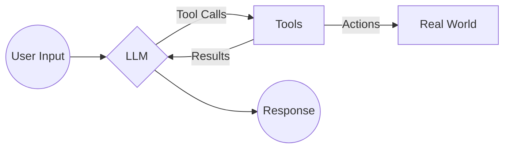


---

# Server & Agent

## Model Context Protocol (MCP)

<br>

- 最广泛采用的 Tool Call 协议

- 轻松启用 / 关闭工具

- 支持官方 JSON 格式配置文件


---


<FocusOn :left="310" :top="355" :radius="120" />

---

# FileSystem

<div h-2 />

- **一套接口**，支持**两种实现**
  - **OSFS**：本地文件系统
  - **JFS**：JuiceFS 分布式文件系统

- 原生支持**嵌入文件**

- 原生支持**元数据**

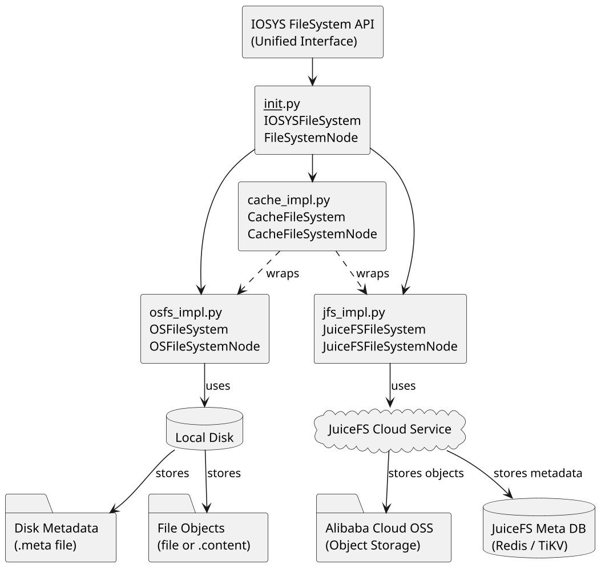

---

# FileSystem


## {.scale-80.origin-left-top}

<div text-xl mt-4>

- 云原生文件存储，分布式，支持多种存储后端
  - (我们目前使用阿里云 OSS)
- 相比 Ceph 和 3FS 的优势：跨平台，泛用性强，容易二次开发

</div>

<div italic op-80 mt-8>
Not new but it works!
</div>

---

# FileSystem

## “嵌入文件”

Word 中内嵌的图片，如何体现在文件系统中？<br>

- **统一文件与目录**：<span block mt--2 />
  - 目录 $=$ 文件 $-$ 内容
  - 文件 $=$ 目录 $+$ 内容

- 嵌入文件作为**源文件的子节点**

- 嵌入文件具有**一致操作接口**

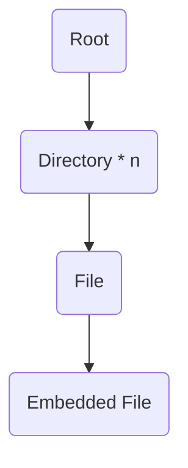

---


<FocusOn :left="560" :top="375" :radius="140" />

---

# File Parser

多模态数据的**解析**、**文本化**与**概要生成**
<div h-4 />

- 文本化功能基于**修改后的 markitdown**
- 使用 LLM 生成**多层级概要**
- 提取**嵌入文件**

<br>

- 便于索引和检索
- 节约后续操作的成本和时间


---

# File Parser

<div v-drag="[18,104,350,NaN]">
<div scale-80 ml-1 text-xl> 输入: Word 文档 </div>

</div>

<div v-drag="[352,-3,450,NaN]">


<div scale-80>

<div mb-2 text-xl>
输出: 文本
</div>


```md {class:'children:children:text-sm!'}


ZKY-GD-4 智能光电效应（普朗克常数）实验仪如上图所示。

实验数据记录以及分析处理基本必做实验内容

1. 零电流法、补偿法分别测遏止电压；
2. 饱和光电流与光强之间的变化关系。

1. 固定一种直径大小光阑的情况下，分别测量 5 种不同单色光照射下，光电流的遏止电压。

```

<div h-8 />

<div flex gap-8>
<div>
<div mb-1 text-xl>
输出: 嵌入文件
</div>

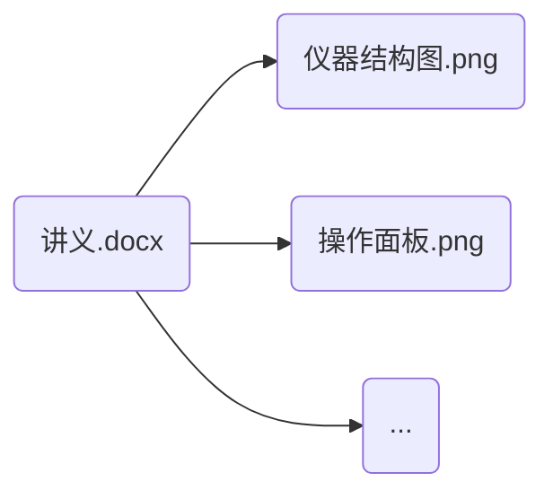

</div><div ml-4>
<div text-xl>
输出: 元数据
</div>

<div text-4 mt-1>


- 文件类型： Word 文档
- 文件大小： 1.2 MB
- 创建时间： 1751116881663
- ...

</div>
</div>
</div>
</div>
</div>

---

# File Parser

### Async Execution

<br>

- 不需要在第一时间完成解析

- 优先执行其他任务

<div op-60 mt-12>

- TODO: Multiple Threading / Processing
- (GIL free in latest Python?)

</div>

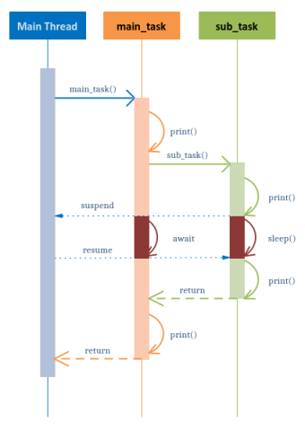

---


<FocusOn :left="590" :top="124" :radius="50" />

---

# Knowledge Graph

借助大语言模型，提取文件中的实体与关系
<div h-4 />

- **输入：** 文本（来自于 File Parser 模块）
- **输出：** 尽可能多的 **“主-谓-宾”**（Subject-Predicate-Object）三元组。
- **格式：** 将三元组输出为易于程序读取的格式，(JSON)。

<div h-8 />

> **System Prompt**:
>
> You are an AI expert specialized in knowledge graph extraction. 
> Your task is to identify and extract factual Subject-Predicate-Object (SPO) triples from the given text.
> Focus on accuracy and adhere strictly to the JSON output format requested in the user prompt.
> Extract core entities and the most direct relationship.

---

# Knowledge Graph

### 工作流程

<div h-10 />

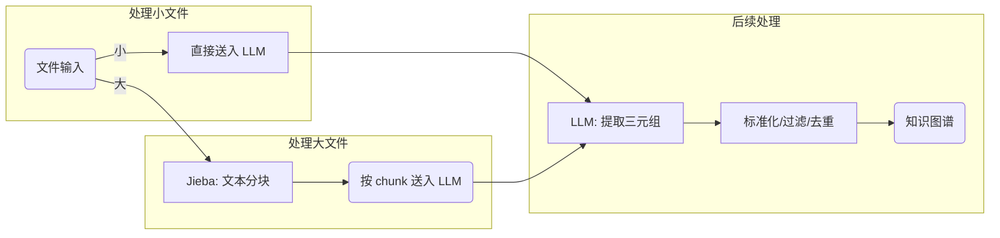

---

# Knowledge Graph

- **按需生成**：不是所有文件都需要知识图谱

- **持久化**：避免重复生成

- **合并展示**：支持合并展示目录中的所有知识图谱

<div flex>
<div>

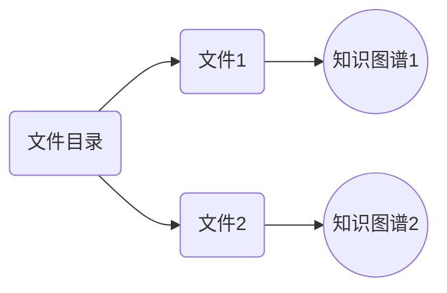

</div>

<div mx-8 flex items-center>
<carbon-arrow-right text-3xl my-2 />
</div>

<div>

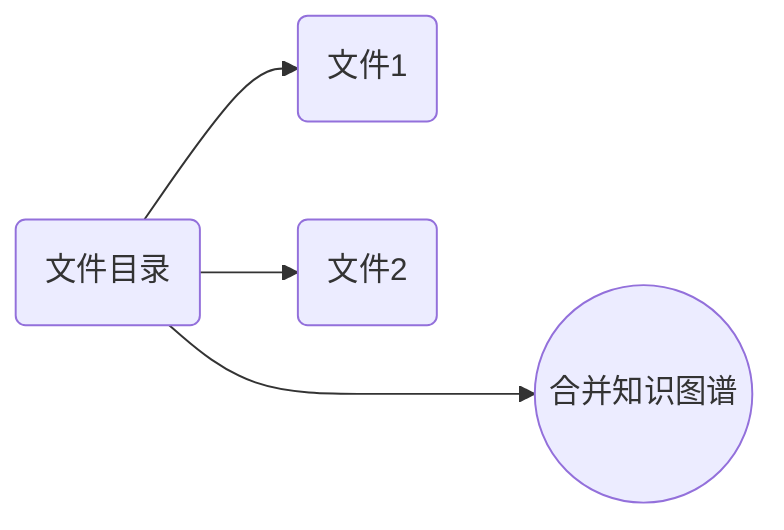

</div>
</div>

---

<div text-xl mt--6>三体人物关系（部分）</div>


---
hide: true
---


<FocusOn :left="530" :top="92" :radius="50" />

---
hide: true
---

# File Graph

---


<FocusOn :left="532" :top="157" :radius="50" />

---

# Vector Indexing

## Architecture

**Indexing**:

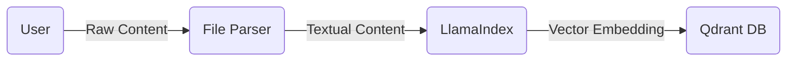

**Retrieval**:

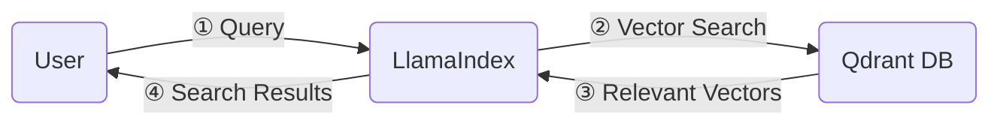

---

# Vector Indexing & RAG

## 一些探索

<br>

- 这是我们花最多时间探索的部分

- 尝试过 GraphRAG 和 RAGFlow <span>(见 `rag/examples` 文件夹)</span>

- 最终选择 LlamaIndex，是因为它的成熟度和它的 API 友好程度

- 仍需进一步调优

---


<FocusOn :left="355" :top="50" :radius="110" />

---

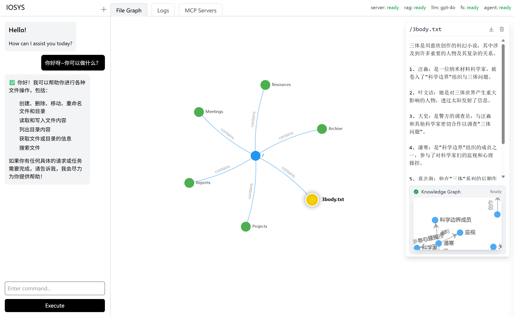

<div v-drag="[575,154,326,NaN,90]">

# Web UI {.text-14!}

</div>

---

# Web UI

### 设计理念

<div h-4 />

- 支持直接操作文件: **很多情况下，直接操作比请求 Agent 更方便**
- 直观: 图的展示形式
- 美观: Geist style
- <span border-b-1.5 border-black> Vibe coding </span>

<br>

<div ml-4 mt-4 text-2xl>

<logos-typescript-icon />  <carbon-add /> <logos-vitejs />  <carbon-add /> <logos-vue />  <carbon-add /> <logos-unocss /> <carbon-add /> <logos-vueuse />

</div>


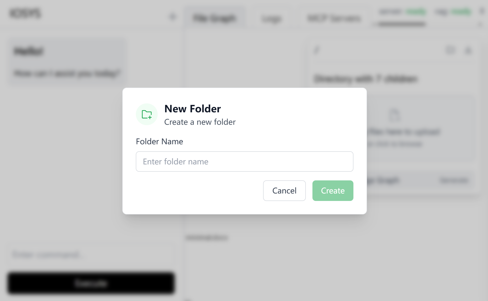

---

# Web UI

<!-- ### 文件预览

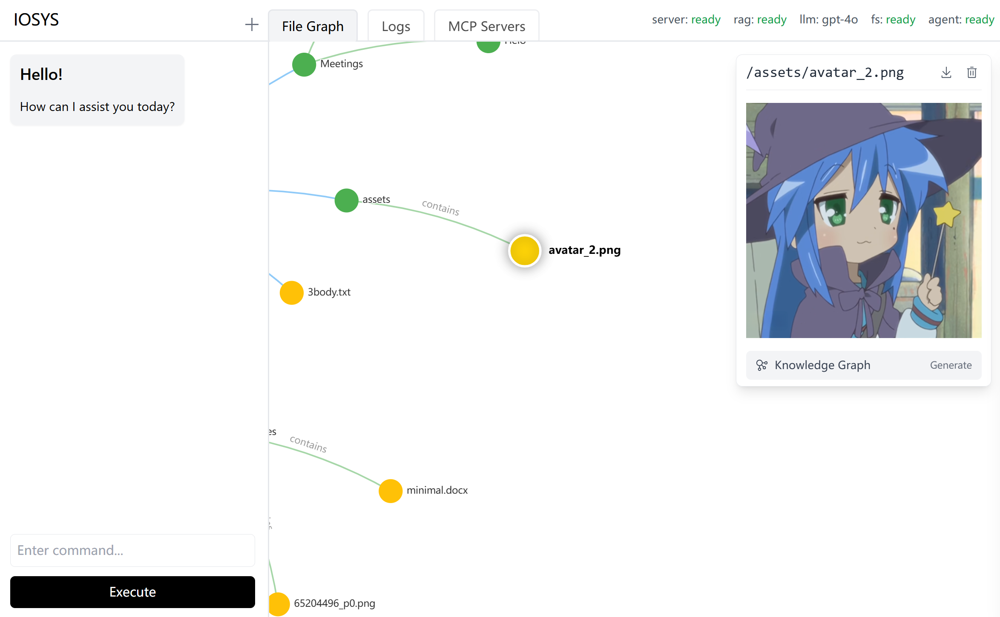

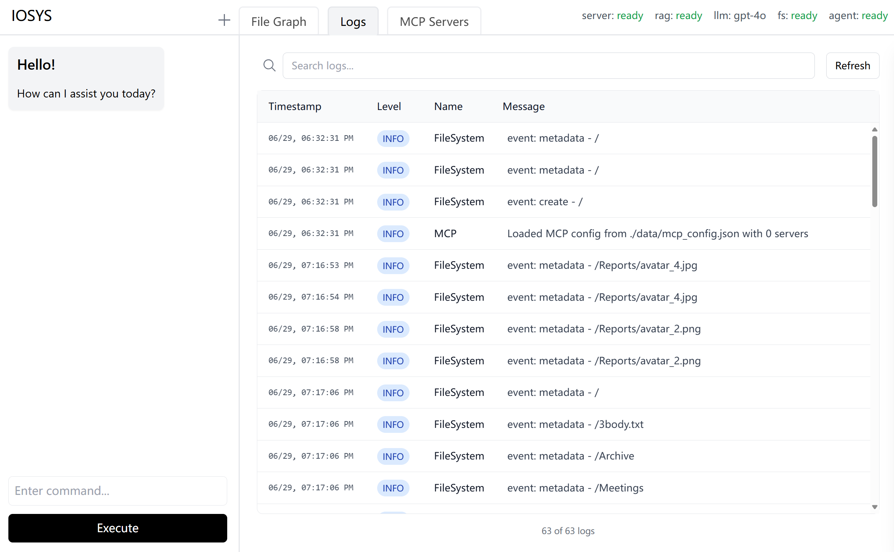 -->
<div grid grid-cols-2 gap-8>
<div>

### 文件预览


</div>
<div>

### 日志列表


</div>
</div>


---

# Web UI

### MCP Configuration


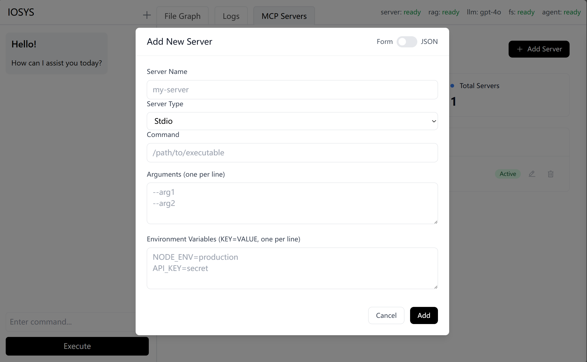

<div v-drag="[568,221,138,83]" text-xl op-60 class="text-sm italic">（Vibed）</div>

---


<FocusOn :left="205" :top="85" :radius="100" />

<!-- <div v-drag="[305,143,194,NaN]" text-3xl mb-2 animate-fade-in>

# A2A Server {.text-red-400!}

</div> -->

---

<div text-3xl mt-2 underlined mb-1> Agent2Agent Protocol (A2A) </div>
<div italic text-4 op-80>(Proposed by Google, 2025.4.9)</div>


<!-- <div fixed inset-2 border="yellow 4 rounded-4" /> -->

<div v-drag="[457,159,308,NaN]" border="1.5 black op-70 rounded-xl" px-2 py-1>

### A2A or MCP? {.mb-2.text-primary}

- A2A: How agents collaborate
- MCP: How functions are provided
- No conflict

</div>

---

# A2A Server

<div h-4 />

- 与其他 Agent 交互
 
<carbon-arrow-shift-down my-2 ml-20 text-xl/>

- 双方都能理解自然语言

<carbon-arrow-shift-down my-2 ml-20 text-xl/>

<div>

- 使用自然语言描述自己
- 接收自然语言请求

</div>

<div fixed top-10 right-10 w-110>

```py {*}{class:'children:children:text-3! children:children:leading-thin!'}
description = """
Helps with manipulating files in the user's file system.
This agent can perform various file operations including reading, writing, and querying files.
It can also get useful information about the user's file content and structure.
""".strip()

tags = [
    "filesystem",
    "querying",
    "file management",
]

examples = [
    "Create a new file named 'example.txt' with the content 'Hello, World!'",
    "Read the content of 'example.txt'",
    "List all files in the current directory",
    "Delete the file 'example.txt'",
    "What is the size of 'example.txt'?",
    "Find a file containing a story about a tree",
]
```

</div>

---

# A2A Server

<div text-4xl text-center mt-24>

该项目在未来的最大意义 (?)

</div>

---
transition: view-transition
---


---

# &emsp;&emsp;Docs Site

<div v-drag="[427,56,414,NaN]" op-80>
Powered by VitePress + Slidev
</div>

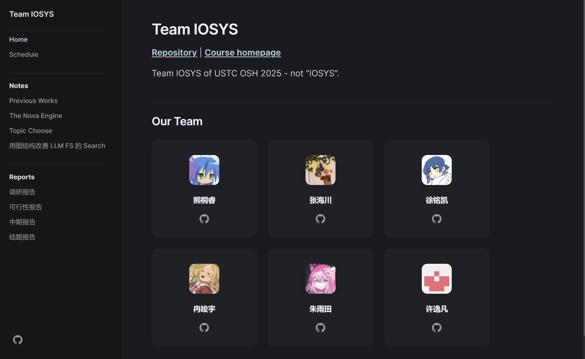

---
transition: view-transition
---


<!-- <div z-100000> -->

# 分工

| 姓名 | 负责模块 | 其他工作 <div inline-block w-60 /> |
| :--- | --- | --- |
| 熊桐睿 | Web UI | 统筹项目，协调组合各模块 |
| 张海川 | File System | 配置云存储服务 |
| 朱雨田 | Knowledge Graph | RAG 的大量调研与实践工作 |
| 许逸凡 | A2A Server | 购置 token |
| 冉竣宇 | File Agent | 大量调试与 bug 修复  |
| 徐铭凯 | File Parser | 测试数据的制备 |
| [(全组)]{.op-50} | Backend | - |


<!-- </div> -->

<style scoped>
table {
  --uno: mt--2;
}
:deep(td) {
  padding: 4px 0.5rem !important;  
}
:deep(td:nth-child(1)) {
  font-weight: bold;
}
:deep(td:nth-child(2)) {
  --uno: font-[Consolas];
}
</style>

---

# 总结

- 一学期的时间过得很快

- 最初的选题（Nova）被否，大家积极寻找新的方向

- 最初比较迷茫

- 随着架构图的完善，大家逐渐找到自己的位置

- 这几天的集中调试，大家都很努力

- 然而还是不够鲁棒，还请见谅

---
class: text-center text-2xl
---

<div h-24 />感谢邢凯老师的指导和支持
<div h-4 />感谢组员们的努力和付出
<div h-4 />感谢助教们的帮助和鼓励

---
layout: end
---

Q & A
