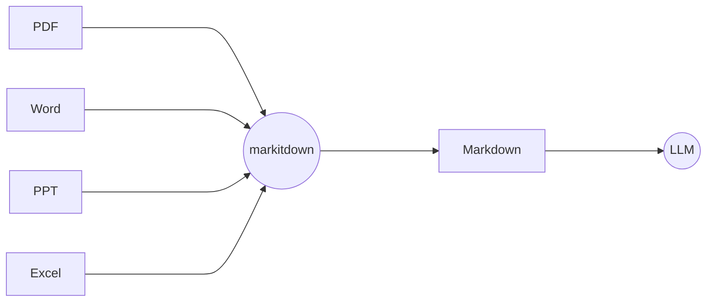

# 中期报告

Team IOSYS {.text-2xl.!op-80} 

---
zoom: 0.85
---

Why{.sect}

## 往年项目

- [My-Glow (2023)](https://github.com/OSH-2023/My-Glow) 基于 [Wowkiddy (2022)](https://github.com/OSH-2022/x-WowKiddy) 和 [TOBEDONE (2022)](https://github.com/OSH-2022/x-TOBEDONE) 

  ✅ 自然语言/语音交互、任务序列转换 <br>
  ⚠️ RAG架构限制 [✨ GraphRAG]{.float-right.mr-30}

- [ArkFS (2024)](https://github.com/OSH-2024/ArkFS)

  ✅ 多模态向量化、二分图映射 <br>
  ⚠️ 图结构简化 [✨ 知识图谱优化、对象-关系建模]{.float-right.mr-30}

- [vivo50 (2024)](https://github.com/OSH-2024/vivo50)

  ✅ 分布式框架优化、鲁棒性监控 <br>
  ⚠️ 传统打标方法 [✨ Llama Index、GraphRAG]{.float-right.mr-30}

<div v-drag="[471,179,323,288]" border="3 yellow-500 dashed rounded-xl" pt-1 pl-2 text-yellow-600>
我们的改进
</div>

---
zoom: 0.85
---

Why{.sect}

## 创新点

<div v-drag="[85,141,400,95]">

### 1. 深度语义理解驱动的文件管理

- 超越关键字和元数据
- 自然语言成为一级交互界面

</div>

<div v-drag="[542,201,335,127]">

### 2. 图状文件组织范式

- 编码大量的异构和关系信息
- 多维度的语义标签
- 多对多的关系映射

</div>

<div v-drag="[150,347,583,159]">

### 3. 全面的语义信息集成

- 集成各个方面的语义信息[（元数据、文件间关系、用户交互历史等）]{.text-sm.op-80}
- 更细粒度的数据

</div>

---

What{.sect}

### 我们要做什么

更强大的文件系统 Agent {.text-3xl.underlined.mb-4}

- 用自然语言进行文件操作
- 用图形式重新组织文件
- 提升增删查改等操作的效率

---

What{.sect}

### 我们要做什么

创新地结合

<div text-xl mt--4>

- 用自然语言进行文件操作
- 用图形式重新组织文件
- 提升增删查改等操作的效率

</div>

协同发挥各自的优势

---

What{.sect}

## 我们要做什么

{.w-100.ml--3}

---

How{.sect}

### 如何让大模型调用外部工具？{.op-80}

Tool & Function Calling {.text-3xl.underlined.mb-4}

```py {*}{class:'w-100'}
tools = [{
  "type": "function",
  "function": {
    "name": "get_weather",
    "description": "Get current temperature.",
    "parameters": {
      ...
    }
  }
}]
```


---

How{.sect}

### 如何保证输出符合格式？{.op-80}

Structured Outputs {.text-3xl.underlined.mb-4}

强制要求 LLM 的输出严格遵守用户提供的 JSON Schema {.text-2xl}

- 可靠的指令生成
- 精确的数据提取
- 简化下游处理
- 类型安全

---

How{.sect}

### 复杂文件的文本化？{.op-80}

[Microsoft/markitdown](https://github.com/microsoft/markitdown){.text-2xl}



---

How{.sect}

### 信息提取和检索？{.op-80}

GraphRAG {.text-3xl.underlined.mb-4}

1. **图结构知识库**：知识库通过图来表示，其中节点代表实体，边表示实体之间的关系
2. **图检索 [(Graph Retrieval)]{.text-sm}**：通过节点和边来寻找相关信息，具备更强的关系推理能力
3. **增强生成 [(Generation)]{.text-sm}**：结合检索到的图信息，生成更加精准和上下文相关的回答

---

How{.sect}

### 分布式？{.op-80}

JuiceFS {.text-3xl.underlined.mb-4}

{.fixed.right-2.top-10.scale-70}

<div text-xl mt-8>

- 云原生文件存储，分布式，支持多种存储后端
- 相比 Ceph 和 3FS 的优势：跨平台，泛用性强，容易二次开发

</div>

---
class: mt--4
---

Recap{.sect}

## 我们的架构图

{.w-120.ml--4.mt--4}

---
layout: end
---

Thanks!
