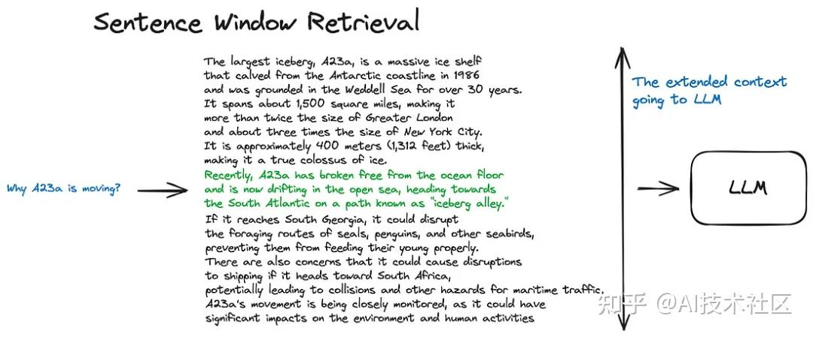
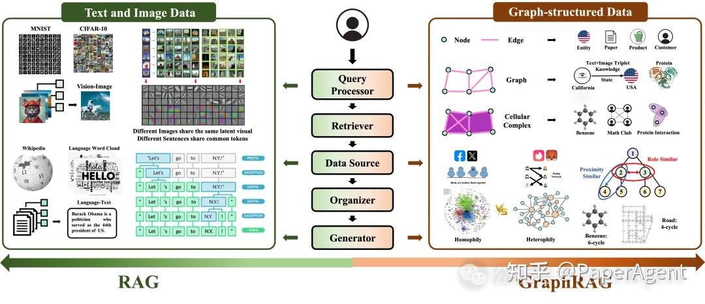
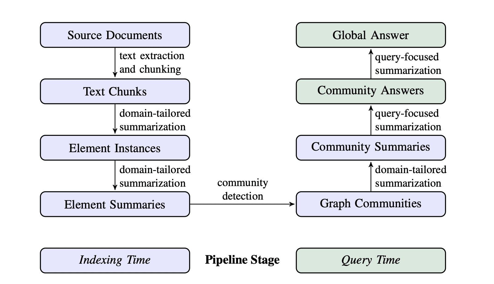

# 用图结构改善 LLM FS 的 Search 调研

> Author：朱雨田

还没写完。目前乱乱的。

## 现有图结构 LLM FS 调研分析

### 往年作业：vivo50

2024 年 OSH 大作业的 vivo50 采用的图结构实际上是**二分图**。图可以分为 tag 集合和文件集合，连边仅存在于这两个集合之间；每更改文件，就利用 LLM 修改其到 tag 集的连边；每进行文件搜索，就将文本映射到 tag 集合的元素权重，并根据 tag 做文件搜索。

这样二分图的结构实际上只指出了文件集合和 tag 集合的关系，而对文件之间的关系、tag 之间的关系并没有明确的优化。具体地、tag 之间的关系由 LLM 对文本的翻译决定，而文件本身看不到 tag 之间的联系；文件之间的关系则仅能由共同 tag 的特征体现。

我认为这样的图结构是有待优化的。


## 与图结构无关的前沿 LLM FS 调研

### AIOS-LSFS

> 待完善。

AIOS-LSFS 中对文件的检索采用了平凡的 RAG。

在这个项目中 search 部分的具体代码为：

```python
    def search(self, query: str, top_k: int = 5) -> List[Dict[str, Any]]:
        """Search for similar documents.
        
        Args:
            query: Search query
            top_k: Number of results to return
            
        Returns:
            List of dictionaries containing document content and similarity score
        """
        if not self.documents:
            return []
            
        # Get query embedding
        query_embedding = self.model.encode([query])
        
        # Calculate cosine similarities
        similarities = cosine_similarity(query_embedding, self.embeddings)[0]
        
        # Get top k results
        top_indices = np.argsort(similarities)[-top_k:][::-1]
        
        results = []
        for idx in top_indices:
            results.append({
                'content': self.documents[idx],
                'score': float(similarities[idx])
            })
            
        return results
```

可以看到它的运行模式是：将信息用经过训练的 LLM 映射到一个向量空间中；每当接收到一个文本，就也将文本映射到该向量空间中，并在空间中寻找与该文本的 k 近邻信息并分配权重、输出。

### 往年作业：TONEBONE

> To be implemented


### Deepseek 3FS

3FS（Fire-Flyer File System）作为一款高性能的分布式文件系统，专门为满足 AI 训练及推理的需求而设计。其采用高性能的 NVMe 与 RDMA 网络构建共享存储层，标志着数据存取的新纪元。自 2025 年 2 月开源以来，3FS 的设计架构由多个模块组成：集群管理服务（Cluster Manager）、元数据服务（Metadata Service）、存储服务（Storage Service）及客户端（FUSE Client、Native Client）。所有模块通过 RDMA 网络高效通信，确保高并发和低延迟的数据访问。

#### 3FS 的主要功能

- **高性能数据访问**：聚合数千个 SSD 的吞吐量和数百个存储节点的网络带宽，提供高达 6.6TiB/s 的读取吞吐量。支持大规模集群中的高吞吐量并行读写，优化 AI 训练和推理任务中的数据加载效率。
- **强一致性保障**：实现链式复制与分配查询（CRAQ）技术，确保数据的强一致性，简化应用开发复杂性。
- **通用文件接口**：提供无状态元数据服务，支持事务性键值存储 (如 FoundationDB），用户无需学习新的存储 API。
- **优化 AI 工作负载**：
  - 数据准备：高效管理大量中间输出，支持层次化目录结构。
  - 数据加载：支持跨计算节点的随机访问，无需预取或数据集洗牌。
  - 检查点支持：为大规模训练提供高吞吐量并行检查点功能。
  - KVCache：为推理任务提供高吞吐量、大容量的缓存替代方案，优化推理效率。
- **高扩展性和灵活性**：支持大规模集群部署，适用于从单节点到数千节点的多样化应用场景。

#### 3FS 的技术原理

- **分离式架构**：基于计算与存储分离的设计，将存储资源集中管理，用高速网络 (如 RDMA）实现数据的高效传输。让应用以”位置无关”的方式访问存储资源，简化资源管理。
- **链式复制与分配查询 (CRAQ)**：为实现强一致性，3FS 基于 CRAQ 技术。基于链式复制确保数据在多个副本间的一致性，用分配查询优化读取性能，减少延迟。
- **无状态元数据服务**：3FS 推出无状态的元数据服务，基于事务性键值存储（如 FoundationDB），提高系统的可扩展性，降低元数据管理的复杂性。
- **DirectI/O与RDMA优化**：基于 DirectI/O 直接访问 SSD，避免使用文件缓存，减少 CPU 和内存开销，用 RDMA 技术实现高效的数据传输，进一步提升性能。
- **KVCache 技术**：在推理任务中，基于 KVCache 缓存关键中间结果，避免重复计算，显著提高推理效率。KVCache 结合高吞叶量和大容量的优势，是 DRAM 缓存的低成本替代方案。
- **数据局部性优化**：基于优化数据布局和访问模式，减少数据传输的延迟和带宽消耗，特别是在大规模分布式训练和推理任务中表现出色。

#### 3FS 的性能表现

- **大规模读取吞吐量**：在由 180 个存储节点组成的集群中，每个存储节点配备 2x200GbpsInfiniBand 网卡和 16 个 14TiBNVMeSSD。大约 500+ 个客户端节点用于读压测，每个客户端节点配置 1x200GbpsInfiniBand 网卡。在训练作业的背景流量下，最终聚合读吞吐达到约 6.6TiB/s。
- **GraySort 性能测试**：3FS 在 GraySort 基准测试中表现出色。GraySort 是大规模数据排序测试，用在衡量分布式系统的数据处理能力。测试集群包括 25 个存储节点（每个节点 2 个 NUMA 域，每个域 1 个存储服务，2×400GbpsNIC）和 50 个计算节点（每个节点 192 个物理核心，2.2TiB 内存，1x200GbpsNIC)。在该测试中，3FS 成功完成 110.5TiB 数据的排序任务，分布在 8192 个分区中，耗时仅 30 分钟 14 秒，平均吞吐量达到 3.66TiB/min。
- **KVCache 推理优化**：KVCache 是 3FS 为优化 LLM（大语言模型）推理过程而设计的缓存技术，基于缓存解码层中的关键向量和值向量，避免重复计算。在 KVCache 的性能测试中，读取吞吐量峰值达到了 40GiB/s，显著提升推理效率。KVCache 的垃圾回收 (GC) 操作也表现出高 IOPS 性能，确保缓存的高效管理和更新。

####3FS 的应用场景

- 大规模 AI 训练：高效支持海量数据的快速读写，提升训练速度。
- 分布式数据处理：优化数据加载和管理，支持随机访问，无需预取或洗牌。
- 推理优化：通过 KVCache 缓存中间结果，减少重复计算，提升推理效率。
- 检查点支持：提供高吞吐量的并行检查点功能，保障训练任务的稳定性和可恢复性。
- 多节点计算环境：无缝集成到大规模集群，支持灵活扩展，满足不同规模的 AI 应用需求。

## Graph RAG 技术调研

### RAG

RAG（Retrieval Augmented Generation）为生成式模型提供了与外部世界互动提供了一个很有前景的解决方案。RAG 的主要作用类似搜索引擎，找到用户提问最相关的知识或者是相关的对话历史，并结合原始提问（查询），创造信息丰富的 prompt，指导模型生成准确输出。其本质上应用了情境学习（In-Context Learning）的原理。

RAG 可分为 5 个基本流程：知识文档的准备；嵌入模型（embedding model）；向量数据库；查询检索和生产回答。


基础 RAG 的操作流程大致如下：首先，你需要将文本切分成小段，然后利用某种 Transformer 编码器模型，将这些文本段转换成向量形式。接着，把所有向量汇集到一个索引里。最后，你需要为大语言模型（Large Language Model, LLM）制定一个提示词，这个提示词会指导模型根据我们在搜索步骤中找到的上下文信息来回答用户的查询。

在实际运行过程中，我们会用同一个编码器模型把用户的查询转换成向量，然后根据这个向量在索引中进行搜索。系统会找到最相关的前 k 个结果，从数据库中提取相应的文本段，然后把这些文本段作为上下文信息输入到大语言模型的提示词中。


为了进一步优化该模型，研究者提出了很多高级 RAG 技术。


#### 1. 分块和向量化

> 我觉得可以试试。这个试错成本不高。

分块就是把输入切割成合适大小的句子或段落，并保持原有意义不变，以使得向量化更加高效。市面上有多个文本分割工具可完成该任务。

另一篇文章仔细讲解了分块的各种做法：内容分块（按标点符号等语义）、递归分块（从粗略到精细慢慢分）、从小到大分块、特殊结构分块。

#### 2. 搜索索引

##### 2.1 向量存储索引

> AIOS-LSFS 里我们找到的那段代码做的就是这件事。

在 RAG 管道中，至关重要的部分是搜索索引，它用来存储我们在前一步骤中生成的向量化内容。目前有大量优化方案对索引的查找进行优化，实现高效查找向量空间中与查询内容的 k 近邻元素。


##### 2.2 层次索引

如果您需要从大量文档中检索信息，高效的搜索方法非常关键，这样才能找到相关信息，并将其汇总为一个包含源引用的统一答案。在处理大型数据库时，一个有效的做法是创建两个索引——一个由摘要组成，另一个由文档块组成，然后分两步进行搜索：首先通过摘要过滤出相关文档，接着只在这个相关群体内进行搜索。

> 这个就是我们在群里讨论时想到的。
>
> 23℃: 03-27 21:35:05
> 那你希望做的是
>
> Touko: 03-27 21:35:05
> 我看了下
>
> 23℃: 03-27 21:35:17
> 把这些文件预先分类，分配到多个不同的向量空间内
>
> Touko: 03-27 21:35:25
> 他的搜索空间居然是一个一个添加文件（
>
> 23℃: 03-27 21:35:33
> 然后先选定向量空间，再在向量空间中具体搜索
>
> 23℃: 03-27 21:35:36
> 来降低复杂度吗
>
> 23℃: 03-27 21:35:52
> 把"数组"变成"搜索树"
>
> 23℃: 03-27 22:16:19
> 其实本来也就是个树形结构了 只不过不是按照知识分类做的 而是做的空间划分树（
>
> 23℃: 03-27 22:17:07
> 那你觉得按照知识分类得到的树 比起对向量空间做暴力空间划分得到的树 有什么优势吗
>
> 23℃: 03-27 22:17:15
> 我觉得肯定是有的 但是什么呢


##### 2.3 假设性问题和 HyDE

另一个方法是让 LLM 为每个块生成一个假设性问题，并将这些问题以向量形式嵌入。在运行时，针对这个问题向量的索引进行查询搜索（用问题向量替换我们索引中的块向量），检索后将原始文本块作为上下文发送给 LLM 以获取答案。这种方法由于查询和假设性问题之间的语义相似性更高，从而提高了搜索质量。

还有一种反向逻辑的方法叫做 HyDE——您可以让 LLM 根据查询生成一个假设性回答，然后将该回答的向量与查询向量一起用来提高搜索质量。

##### 2.4 上下文增强

>  我觉得这个更加倾向于是**输出答案的优化**，而不是查找文档的优化。

这里的理念是检索较小的块以提高搜索质量，但同时增加周围的上下文以供 LLM 进行推理分析。

有两种方法——一是通过在检索到的较小块周围添加句子来扩展上下文，二是递归地将文档分割成多个包含较小子块的大型父块。

1. 通过在检索到的较小块周围添加句子来扩展上下文



2. 这里的思路与句子窗口检索器十分相似——它旨在搜索更精细的信息片段，然后在将这些上下文信息提供给 LLM 进行推理之前，先扩展上下文窗口。文档被分割成较小的子块，这些子块又与更大的父块相对应。文档被分割成一个层级化的块结构，随后最小的叶子块被发送至索引中。在检索过程中，我们会检索出 k 个叶子块。如果存在 n 个块都指向同一个更大的父块，那么我们就用这个父块来替换这些子块，并将其送入大语言模型（LLM）用于生成答案。


##### 2.5 融合检索或混合搜索

这是一个相对较旧的概念，它结合了两种不同的搜索方法：一种是基于关键词的传统搜索方法，使用稀疏检索算法（如 tf-idf 或行业标准 BM25），另一种是现代的语义或向量搜索。这两种方法被融合在一起，以产生一个综合的检索结果。


#### 3. 重新排名和过滤

>  就是得到了 k 个带权重的结果之后，优化在这里选一个的过程。

我们使用上述任何一种算法得到了检索结果，接下来需要通过过滤、重新排名或进行一些转换来进一步优化这些结果。LlamaIndex 提供了多种后处理器，可以基于相似度评分、关键词、元数据等过滤结果，或者使用其他模型进行重新排名，如 LLM、句子 - 转换器交叉编码器、Cohere 重新排名端点，或者基于元数据如日期的新近性来进行——几乎涵盖了你能想到的所有情况。

#### 4. 查询转换

> 用 LLM 优化 query，再把 query 做 embedding。

查询转换是一组技术，它们使用 LLM 作为推理引擎来修改用户输入，以此提高检索质量。实现这一目标有多种不同的方法。


如果查询内容复杂，大语言模型（LLM）可以将其分解为几个子查询。例如，如果您问：

—— “在 Github 上，Langchain 和 LlamaIndex 哪个框架的 star 更多？”

我们不太可能直接在语料库中找到这样的比较，因此将这个问题分解为两个假设更简单和具体信息检索的子查询是合理的：

——“Langchain 在 Github 上有多少 star？”

——“LlamaIndex 在 Github 上有多少 star？”

这些查询将并行执行，然后检索到的上下文将组合在一个提示中，供大语言模型综合出对初始查询的最终答案。两个库都实现了这一功能——Langchain 中作为多查询检索器，在 LlamaIndex 中作为子问题查询引擎。

#### 5. 对话引擎

> 就是把用户查询的上下文也整理进 query 里。我觉得这个对我们来说没那么重要。

在构建一个能够对单个搜索查询反复有效工作的高效 RAG 系统中，下一个关键进展是聊天逻辑的开发。

这种逻辑的开发是为了支持用户提出后续问题、处理上下文中的指代或与先前对话上下文相关的任意命令。为了解决这一问题，研究者们采用了一种查询压缩技术，这种技术在处理用户的查询时同时考虑了聊天的上下文。


#### 6. 查询路由

> 没看懂。也许可以再查查。

查询路由是一种基于 LLM 的决策步骤，用于确定针对用户的查询接下来应采取的行动。通常的选项包括概括回答、针对某个数据索引执行搜索，或尝试多条不同的途径，然后将它们的结果综合成一个答案。

查询路由器还用于选择合适的索引或更广泛的数据存储位置来处理用户查询。这可能涉及多个数据来源，比如传统的向量存储、图数据库或关系型数据库，或者是一个索引层级结构。在多文档存储情况下，一个常见的设置是一个概要索引和另一个文档块向量的索引。

#### 7. RAG 中的智能体

> 没看懂。多 LLM 套 LLM 吗。

智能体（Langchain 和 LlamaIndex 都支持）自从第一个 LLM API 发布以来就已存在。其核心理念是为具备推理能力的 LLM 提供一套工具和一个待完成的任务。这些工具可能包括确定性函数（如代码功能或外部 API）或其他智能体。正是这种 LLM 链接的思想促成了 LangChain 的命名。

下图是一个展示多文档代理工作方式的方案，其中包括了查询的路由处理和代理的智能行为模式。

这个复杂方案的一个缺点可以通过图像来理解 —— 由于需要在代理内部与大语言模型（LLM）进行多轮迭代，因此处理速度较慢。需要注意的是，在 RAG 架构中，调用 LLM 总是最耗时的步骤，而搜索则是出于设计考虑而优化了速度。


#### 8. 响应合成器

这是 RAG 架构中的最后一步 —— 基于我们精心收集的所有上下文和用户的初步查询来生成答案。

最简单的方法是直接将所有相关度较高的上下文和查询串联起来，一次性输入到 LLM 中。

然而，还有一些更复杂的方法，这些方法涉及多次使用 LLM 来细化检索到的上下文，并据此生成更加准确的答案。响应合成的几种主要方法包括：

1. 将检索到的上下文分块后逐次发送给大语言模型（LLM），以此迭代地精炼答案。
2. 总结检索到的上下文，使其适应输入提示。
3. 基于不同上下文块生成多个答案，然后将这些答案连接或总结起来。

RAG 的编码器和 LLM 还可以进行微调。这里就不概述了。

> 那么我们需要找一些现有的开源实现，把从用户输入到 query，到 embedded query 的编码器做好，把从文件嵌入到向量空间的编码器做好。
>
> RAG 的目的比起我们文件检索的目标还有一步，即把已经检索好的文档送进 LLM 里概括得到答案。查资料的时候注意把这一部分过滤掉。

## 知识图谱

知识图谱这个术语最初由谷歌在 2012 年 5 月提出，作为其增强搜索结果，向用户提供更多上下文信息的一部分实践。知识图谱旨在理解实体之间的关系，并直接提供查询的答案，而不仅仅返回相关网页的列表。

知识图谱是一种以图结构形式组织和连接信息的方式，其中节点表示实体，边表示实体之间的关系。图结构允许用户高效地存储、检索和分析数据。

它的结构如下图所示：


知识图谱能帮忙搞定文档分割和嵌入的问题。

#### 重新介绍一下嵌入

> 可以看看 3b1b 对注意力机制的介绍。

嵌入通常指的是将**现实世界的事物映射到多维空间中的向量的方法**。例如，我们可以将图像映射到一个（64 x 64）维度的空间中，如果映射足够好，两个图像之间的距离可以反映它们的相似性。

嵌入的另一个例子是 word2vec 算法，它将每个单词都映射到一个向量中。例如，如果嵌入足够好，我们可以对它们进行加法和减法操作，可能会得到以下结果：

`vec(apple) + vec(pie) ≈ vec("apple apie")`，或者向量测量值 `vec(apple) + vec(pie) - vec("apple apie")` 趋近于 0：

```
|vec(apple) + vec(pie) - vec("apple apie")| ≈ 0
```

类似地，“pear”应该比“dinosaur”更接近“apple”：`|vec(apple) - vec(pear)| < |vec(apple) - vec(dinosaur)|`

有了这个基础，理论上我们可以搜索与给定问题更相关的书籍片段。基本过程如下：

- 将书籍分割为小片段，为每个片段创建嵌入并存储它们
- 当有一个问题时，计算问题的嵌入
- 通过计算距离找到与书籍片段最相似的前 K 个嵌入
- 使用问题和书籍片段构建提示
- 使用提示查询 LLM

##### Llama Index

Llama Index 是一个开源工具包，它能帮助我们以最佳实践去做 in-context learning：

- 它提供了各种数据加载器，以统一格式序列化文档/知识，例如 PDF、维基百科、Notion、Twitter 等等，这样我们可以无需自行处理预处理、将数据分割为片段等操作。
- 它还可以帮助我们创建嵌入（以及其他形式的索引），并以一行代码的方式在内存中或向量数据库中存储嵌入。
- 它内置了提示和其他工程实现，因此我们无需从头开始创建和研究，例如，[《用 4 行代码在现有数据上创建一个聊天机器人》](https://twitter.com/jerryjliu0/status/1663213212932902913)。

**SentenceTransformers 是一个可以用于句子、文本和图像嵌入的 Python 库**。可以为 100 多种语言计算文本的嵌入并且可以轻松地将它们用于语义文本相似性、语义搜索和同义词挖掘等常见任务。该框架基于 PyTorch 和 Transformers，并提供了大量针对各种任务的预训练模型。还可以很容易根据自己的模型进行微调。

#### 嵌入和知识图谱的结合

这里的基本实现思想是，作为信息的精炼格式，知识图谱可切割的数据颗粒度比我们人工的分割的更细、更小。将知识图谱的小颗粒数据与原先人工处理的大块数据相结合，我们可以更好地搜索需要全局/跨节点上下文的查询。

最近的几周中，我（引用文章作者）一直在与 Llama Index 社区合作，致力于[将“GraphStore”存储上下文引入 Llama Index](https://github.com/jerryjliu/llama_index/pull/2581)，从而引入了知识图谱的外部存储。首个知识图谱的外部存储是对接开源分布式图数据库 NebulaGraph，目前在我的努力下已经实现了。

在实现过程中，还引入了遍历图的多个跳数选项以及在前 k 个节点中收集更多关键实体的选项，用于在知识图谱中搜索以获得更多全局上下文。上面提到的这些变更还在陆续完善中。

在大模型中引入 GraphStore 后，还可以从现有的知识图谱中进行上下文学习，并与其他索引结合使用，这也非常有前景。因为知识图谱被认为具有比其他结构化数据更高的信息密度。

本文作为开篇，讲述了一些知识图谱和 LLM 的关系。在后续的文章中，将会偏向实操同大家分享具体的知识图谱和 LLM 的应用实践。

> 我想知道这样的知识图谱应该怎样生成。

### Graph RAG



这部分内容我们在一篇文章中阐述过，比如一个查询：“告诉我所有关于苹果和乔布斯的事”，基于乔布斯自传这本书进行问答，而这个问题涉及到的上下文分布在自传这本书的 30 页（分块）的时候，传统的“分割数据，Embedding 再向量搜索”方法在多个文档块里用 TOP-K 去搜索的方法**很难得到这种分散，细粒的完整信息**。而且，这种方法还很**容易遗漏**互相关联的文档块，从而导致信息检索不完整。

一个简单的 Graph RAG（的用户端）可以如下去简单实现：

1. 使用 LLM（或其他）模型从问题中提取关键实体
2. 根据这些实体检索子图，深入到一定的深度（例如，2）
3. 利用获得的上下文利用 LLM 产生答案。

#### Graph RAG 实现的主要功能

##### GraphRAG 框架的关键组件

1. 查询处理器（Query Processor）：负责预处理用户定义的查询，使其能够与图数据源进行交互。
2. 检索器（Retriever）：根据预处理后的查询从图数据源中检索相关内容。
3. 组织者（Organizer）：对检索到的内容进行整理和优化，以提高生成器的性能。
4. 生成器（Generator）：根据组织后的信息生成最终答案。

##### **查询处理器**

在 GraphRAG 框架中，Query Processor 是一个关键组件，它负责对用户输入的查询进行预处理，以便与图数据源进行交互。

查询处理器主要功能：

- 实体识别：从查询中识别出实体，并将其与图数据源中的节点相匹配。
- 关系抽取：识别查询中的关系，并将其与图数据源中的边相匹配。
- 查询结构调整：将自然语言查询转换为结构化查询，如[GQL](https://zhida.zhihu.com/search?content_id=252325034&content_type=Article&match_order=1&q=GQL&zhida_source=entity)（Graph Query Language）。
- 查询分解：将复杂的查询分解为多个子查询，以便进行多步推理。
- 查询扩展：通过添加相关术语来丰富查询，以提高检索的准确性和相关性。


1. 实体识别（Entity Recognition）

  - 目标：识别查询中的实体，并将其与图数据源中的节点相匹配。
  - 技术：包括基于规则的方法、无监督学习方法、基于特征的监督学习方法和深度学习方法。
  - 深度学习方法：如 EntityLinker 和基于 LLM 的提取，能够识别查询中的实体类型，进一步指导检索器识别匹配类型的节点。

2. 关系抽取（Relational Extraction）

  - 目标：从查询中识别关系，并将其与图数据源中的边相匹配。
  - 技术：包括文本表示、上下文编码和三元组预测。
  - 在 GraphRAG 中的应用：用于构建图数据源和匹配查询中的关系，以指导图搜索。

3. 查询结构调整（Query Structuration）

  - 目标：将自然语言查询转换为结构化查询，如 GQL。
  - 技术：利用预训练和微调的 LLM 生成结构化查询。
  - 示例：Cypher、GraphQL 和 SPARQL 等 GQL 工具，用于与属性图数据库进行复杂交互。

4. 查询分解（Query Decomposition）

  - 目标：将复杂的查询分解为多个子查询，以便进行多步推理。
  - 技术：构建问题图，其中每个子查询表示为图中的三元组。
  - 示例：Park 等人通过构建问题图来增强查询分解，提高多步推理和规划任务的性能。

5. 查询扩展（Query Expansion）

  - 目标：通过添加相关术语来丰富查询，以提高检索的准确性和相关性。
  - 技术：包括基于 LLM 的查询扩展，利用图中提到的实体的邻居节点来扩展查询。
  - 示例：Xia 等人通过利用图中提到的实体的邻居节点来扩展查询，Wang 等人通过预定义模板将查询转换为多个子查询。

其他几个模块的介绍在这里略去。在文章中有非常详细的介绍。[一篇 88 页 GraphRAG 全栈技术最新综述 - 知乎](https://zhuanlan.zhihu.com/p/16514918391)

#### Graph RAG 的管线



#### 我们可以做到的实现方案

> 这些要尽早试试。

在 LlamaIndex 中，我们有两种方法实现 Graph RAG：

- `KnowledgeGraphIndex` 只用来对任何私有数据从零构建知识图谱（基于 LLM 或者其他语言模型），再 4 行代码进行 Graph RAG：

```python
graph_store = NebulaGraphStore(
    space_name=space_name,
    edge_types=edge_types,
    rel_prop_names=rel_prop_names,
    tags=tags,
)
storage_context = StorageContext.from_defaults(graph_store=graph_store)

# Build KG
kg_index = KnowledgeGraphIndex.from_documents(
    documents,
    storage_context=storage_context,
    max_triplets_per_chunk=10,
    space_name=space_name,
    edge_types=edge_types,
    rel_prop_names=rel_prop_names,
    tags=tags,
)

kg_query_engine = kg_index.as_query_engine()
```

- `KnowledgeGraphRAGQueryEngine` 则可以在任何已经存在的知识图谱上进行 Graph RAG。不过，我（文章作者）还没有完成这个 [PR](https://link.zhihu.com/?target=https%3A//github.com/jerryjliu/llama_index/pull/7204)。

```python
graph_store = NebulaGraphStore(
    space_name=space_name,
    edge_types=edge_types,
    rel_prop_names=rel_prop_names,
    tags=tags,
)
storage_context = StorageContext.from_defaults(graph_store=graph_store)

graph_rag_query_engine = KnowledgeGraphRAGQueryEngine(
    storage_context=storage_context,
)
```

另外，这篇文章非常详细地介绍了如何用 llama index 实现 GraphRAG：[Building a Graph RAG System: A Step-by-Step Approach - MachineLearningMastery.com](https://machinelearningmastery.com/building-graph-rag-system-step-by-step-approach/)。这一篇文章的翻译见[深度解读 GraphRAG：如何通过知识图谱提升 RAG 系统_Milvus_Zilliz_InfoQ 写作社区](https://xie.infoq.cn/article/18ca7cd7702fc0f03baa02b01)。

#### GraphRAG 的技术优势

GraphRAG 相较于标准 RAG 具有以下显著优势：

1. **关系上下文捕捉**：能够捕捉和利用信息片段之间的复杂关系，提供更丰富、更具语境的信息检索结果。
2. **多跳推理能力**：图结构支持系统沿关系链进行推理，实现更复杂、更深入的逻辑分析。
3. **结构化知识表示**：相比平面文档结构，图结构能更自然地表示层级和非层级关系，更贴近现实世界的知识组织方式。
4. **查询效率提升**：对于涉及关系遍历的查询类型，图结构可显著提高处理效率。

##### GraphRAG 的独特优势与挑战

1. 独特优势

	- **关系理解与推理**：GraphRAG 能够通过图结构理解和推理实体之间的关系，这使得它在处理复杂关系查询任务时具备独特的优势。
	- **知识图谱集成**：GraphRAG 可以很自然地与**知识图谱**集成，通过知识图谱中丰富的关系信息来增强模型的生成和推理能力。

2. 挑战

	- **图的构建与维护**：构建和维护图结构的知识库成本较高，特别是对于涉及大量动态更新的数据，维护图的结构和一致性是一个挑战。
	- **计算复杂度**：当图的节点和边数较多时，检索过程的复杂度将显著增加，可能导致性能下降。

#### 与 RAG 的对比

RAG（检索增强生成）和 Graph RAG 都有自己的优点和缺点。从我审查过的几个测试用例来看，每种方法产生的响应都存在显着差异。

与传统 RAG 相比，Graph RAG 的主要优势在于它能够检索有关查询中提到的实体的全面详细信息。Graph RAG 不仅获取有关查询实体的详细信息，还标识并将其与其他连接的实体相关联。相比之下，标准 RAG 检索的信息仅限于特定文档块，更广泛的关系和联系捕获不足。

Graph RAG 的增强功能也有其自身的挑战。在我的实验中，我提取了一个包含大约 83,000 个令牌的文件，这些令牌需要分块和嵌入。使用标准的 RAG 方法，使用大致相同数量的令牌创建嵌入。当我使用 Graph RAG 摄取同一个文件时，该过程涉及大量的提示和处理，产生了大约 1,000,000 个令牌——几乎是单个文件原始令牌计数的 12 倍。

##### RAG 的应用场景

- **开放领域问答**：由于 RAG 通过检索海量文档并生成回答，适合回答各种开放领域的问题。
- **知识库问答**：适合用于知识库中具有特定领域信息的检索和回答，比如产品文档或技术资料。

##### GraphRAG 的应用场景

- **关系推理问题**：GraphRAG 通过图结构来表示实体及其关系，特别适合需要推理多级关系的问题，例如社会关系网络、知识图谱问答等。
- **实体关联查询**：例如医疗领域中的**药物与症状**关系查询，GraphRAG 可以通过图的方式有效表示和检索出复杂的实体关系。

| **应用场景**     | **RAG**        | **GraphRAG**                         |
| ---------------- | -------------- | ------------------------------------ |
| **开放领域问答** | 👍 适合         | ⚠️ 不完全适合                         |
| **关系推理**     | ⚠️ 一般推理能力 | 👍 适合，尤其在实体之间存在复杂关系时 |
| **知识库检索**   | 👍 适合         | ⚠️ 适合于关系明确的知识库             |
| **图数据推理**   | 🚫 不适合       | 👍 适合，能够有效利用节点和边的信息   |

#### Graph RAG 的不足与优化方向

文章《From RAG to GraphRAG...》总结了 Graph RAG 的不足：

> GraphRAG, like RAG, has clear limitations, which include how to form graphs, generate queries for querying these graphs, and ultimately decide how much information to retrieve based on these queries. The main challenges are ‘query generation’, ‘reasoning boundary’, and ‘information extraction’.

总的来看分为三大类：

1. **信息抽取**：如何构建高质量的知识图谱？
2. **查询生成**：如何在生成知识图谱上的查询？
3. **推理边界**：如何限制查询结果的规模？

像前边提到的，知识抽取/关键词/查询语言的微调模型主要专注于信息抽取和查询生成。另外，**论文《Reasoning on Graphs...》**实现的基于图的推理增强框架（RoG）则是在推理边界方向尝试的创新（思路有点类似 RAT）：


当然上述三个阶段也可以被简化合并为两个阶段：内容索引阶段和检索生成阶段。我们就这两个大的阶段分别讨论 Graph RAG 后续可能的优化方向和思路。

##### 内容索引阶段

Graph RAG 的内容索引阶段主要目标便是构建高质量的知识图谱，值得继续探索的有以下方向：

- **图谱元数据**：从文本到知识图谱，是从非结构化信息到结构化信息的转换的过程，虽然图一直被当做半结构化数据，但有结构的 LPG（Labeled Property Graph）除了有利于图存储系统的性能优化，还可以协助大模型更好地理解知识图谱的语义，帮助其生成更准确的查询。
- **知识抽取微调**：通用大模型在三元组的识别上实际测试下来仍达不到理想预期，针对知识抽取的微调模型反而表现出更好地效果，如前面提到的 OneKE。
- **图社区总结**：这部分源自于微软的 Graph RAG 的研究工作，通过构建知识图谱时生成图社区摘要，以解决知识图谱在面向总结性查询时“束手无策”的问题。另外，同时结合图社区总结与子图明细可以生成更高质量的上下文。
- **多模态知识图谱**：多模态知识图谱可以大幅扩展 Graph RAG 知识库的内容丰富度，对客观世界的数据更加友好，浙大的[MyGO](https://arxiv.org/abs/2404.09468)框架提出的方法提升 MMKGC（Multi-modal Knowledge Graph Completion）的准确性和可靠性。Graph RAG 可以借助于 MMKG（Multi-modal Knowledge Graph）和 MLLM（Multi-modal Large Language Model）实现更全面的多模态 RAG 能力。
- **混合存储**：同时使用向量/图等多种存储系统，结合传统 RAG 和 Graph 各自的优点，组成混合 RAG。参考**文章《GraphRAG: Design Patterns...》**提出的多种 Graph RAG 架构，如图学习语义聚类、图谱向量双上下文增强、向量增强图谱搜索、混合检索、图谱增强向量搜索等，可以充分利用不同存储的优势提升检索质量。


##### 检索生成阶段

Graph RAG 的检索生成阶段主要目标便是从知识图谱上召回高质量上下文，值得继续探索的有以下方向：

- **图语言微调**：使用自然语言在知识图谱上做召回，除了基本的关键词搜索方式，还可以尝试使用图查询语言微调模型，直接将自然语言翻译为图查询语句，这里需要结合图谱的元数据以获得更准确的翻译结果。过去，我们在[Text2GQL](https://mp.weixin.qq.com/s/rZdj8TEoHZg_f4C-V4lq2A)上做了一些初步的工作。
- **混合 RAG**：这部分与前边讲过的混合存储是一体的，借助于底层的向量/图/全文索引，结合关键词/自然语言/图语言多种检索形式，针对不同的业务场景，探索高质量 Graph RAG 上下文的构建。
- **测试验证**：Graph RAG 的测试和验证可以参考传统 RAG 的 Benchmark 方案，如[RAGAS](https://arxiv.org/abs/2309.15217)、[ARES](https://arxiv.org/abs/2311.09476)、[RECALL](https://arxiv.org/abs/2311.08147)、[RGB](https://arxiv.org/abs/2309.01431)、[CRUD-RAG](https://arxiv.org/abs/2401.17043v2)等。
- **RAG 智能体**：从某种意义上说，RAG 其实是 Agent 的简化形式（知识库可以看到 Agent 的检索工具），同时当下我们也看到 RAG 对记忆和规划能力的集成诉求（如 RAT/RoG 等），因此未来 RAG 向带有记忆和规划能力的智能体架构演进几乎是必然趋势。另外，Agent 自身需要的长期记忆存储也会反向依赖 RAG 的知识库，所以 RAG 与 Agent 其实是相辅相成、互相促进的。

## 如果以此为选题，我们能做什么

1. 把以往的文件系统项目试着跑起来，阅读代码试着找到它们与 RAG 相关联的，可以改进成 Graph RAG 的部分。
2. 思考 Graph RAG 对怎样的文件系统有优化优势。
3. 按照文章手动实现一个 Graph RAG。文章写得很详细。我们要实现两个阶段：内容索引阶段（得到高质量的知识图谱），检索生成阶段（从知识图谱上高质量召回上下文）。

## 参考资料

https://github.com/OSH-2024/vivo50

[agiresearch/AIOS: AIOS: AI Agent Operating System](https://github.com/agiresearch/AIOS?tab=readme-ov-file)

[agiresearch/AIOS-LSFS: From Commands to Prompts: LLM-based Semantic File System for AIOS](https://github.com/agiresearch/AIOS-LSFS)

[iyaja/llama-fs: A self-organizing file system with llama 3](https://github.com/iyaja/llama-fs)

[深度好文！最全的大模型 RAG 技术概览 - 知乎](https://zhuanlan.zhihu.com/p/678893732)

[读懂 RAG 这一篇就够了，万字详述 RAG 的 5 步流程和 12 个优化策略 - 知乎](https://zhuanlan.zhihu.com/p/680574405)

[3FS - DeepSeek 推出的高性能分布式文件系统 | AI 工具集](https://ai-bot.cn/3fs/)

[DeepSeek 3FS 与 JuiceFS：AI 时代的双雄大战与技术深度解读_存储_数据_应用](https://www.sohu.com/a/872571417_122004016)

[DeepSeek 3FS：端到端无缓存的存储新范式 - 知乎](https://zhuanlan.zhihu.com/p/27355706799)

[关于 LLM 和图、图数据库的那些事 - 文章 / 图学习和 LLM - NebulaGraph 技术社区](https://discuss.nebula-graph.com.cn/t/topic/13797)

[图技术在 LLM 下的应用：知识图谱驱动的大语言模型 Llama Index - 文章 / 图学习和 LLM - NebulaGraph 技术社区](https://discuss.nebula-graph.com.cn/t/topic/13624)

[Graph RAG: 知识图谱结合 LLM 的检索增强 - 知乎](https://zhuanlan.zhihu.com/p/660552323)

[一篇 88 页 GraphRAG 全栈技术最新综述 - 知乎](https://zhuanlan.zhihu.com/p/16514918391)

[Building a Graph RAG System: A Step-by-Step Approach - MachineLearningMastery.com](https://machinelearningmastery.com/building-graph-rag-system-step-by-step-approach/)

[From Local to Global: A GraphRAG Approach to
Query-Focused Summarization](https://arxiv.org/pdf/2404.16130)

[microsoft/graphrag: A modular graph-based Retrieval-Augmented Generation (RAG) system](https://github.com/microsoft/graphrag?tab=readme-ov-file)

[Welcome - GraphRAG](https://microsoft.github.io/graphrag/)

[LLM 之 RAG 理论（十二）| RAG 和 Graph RAG 对比 - 知乎](https://zhuanlan.zhihu.com/p/710477309)

[GraphRAG 与 RAG 的深度对比 - 小蓝博客](https://www.8kiz.cn/archives/23695.html)

[Vector | Graph：蚂蚁首个开源 Graph RAG 框架设计解读 - Florian - 博客园](https://www.cnblogs.com/fanzhidongyzby/p/18252630/graphrag)