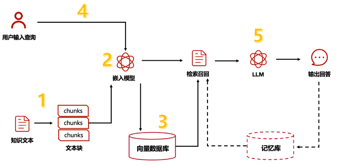

# 调研报告

小组成员：熊桐睿，冉竣宇，朱雨田，徐铭凯，许逸凡，张海川

## 目录

[TOC]

## 项目背景

在最近几年 AI 技术的快速发展下，人工智能在各个领域都有了广泛的应用。不仅仅局限于传统的领域（例如：目前最普遍的 LLM 与用户"对话"；Diffusion 图像生成；专注于图像分析的 CNN 等等），也有人提出了 AIOS 的概念，即 AI 结合的操作系统。

AIOS 的设想架构如下:


这张图展示了 AIOS 分层式的系统架构，旨在将AI Agent（智能体）的能力与操作系统（OS）的功能融合。其结构可以从上到下分为三层：

1.  **应用层 (Application Layer):**
    *   **Agent Application:** 这是顶层，包含了各种具体的AI智能体应用。图中示例包括：旅行Agent、推荐Agent、编码Agent、数学Agent、叙事Agent等。这些Agent是面向特定任务或领域的。
    *   **AIOS-Agent SDK (Software Development Kit):** 这是一个关键的中间件/接口层。它直接服务于上层的Agent应用。其主要作用是：
        *   接收来自Agent应用的请求。
        *   **区分请求类型：**
            *   **LLM相关查询 (LLM Related Queries):** 如推理与规划、工具解析、代码生成等需要大型语言模型能力的请求，会被导向AIOS Kernel处理。
            *   **非LLM相关查询 (Non-LLM Related Queries):** 如传统的文件操作、网络请求、键盘/鼠标输入等，会被导向标准的OS Kernel处理。

2.  **内核层 (Kernel Layer):**
    *   这一层是系统的核心，包含了两个并行的内核组件：传统的OS内核和专门的AIOS内核。
    *   **OS Kernel (操作系统内核):**
        *   包含标准操作系统的核心组件：进程调度器 (Process Scheduler)、内存管理器 (Memory Manager)、文件系统 (Filesystem)、硬件驱动 (Hardware Driver)。
        *   负责管理系统的基本资源，处理来自应用层的非LLM相关请求，并直接与硬件交互（通过硬件驱动）。
    *   **AIOS Kernel (AI操作系统内核):**
        *   这是为AI Agent和LLM设计的专用内核。
        *   **AIOS System Call:** 提供给AIOS-Agent SDK调用的接口，用于处理LLM相关的复杂任务。
        *   **核心组件:**
            *   **LLM Core(s):** 可能是指运行大型语言模型的核心引擎或处理器。
            *   **Agent Scheduler:** 负责调度和管理各个Agent的执行。
            *   **Context Manager:** 管理Agent执行所需的上下文信息。
            *   **Memory Manager:** 管理Agent或LLM运行所需的内存资源，可能与OS的内存管理器有协作。
            *   **Storage Manager:** 管理Agent运行所需的数据存储。
            *   **Tool Manager:** 管理和协调Agent可以使用的外部工具或API。
            *   **Access Manager:** 控制Agent对资源和工具的访问权限。
        *   **与OS Kernel的交互:** AIOS Kernel 需要通过 **OS System Call** 接口与底层的OS Kernel交互，以获取硬件资源（如通过OS内存管理器分配内存，通过文件系统读写磁盘等）。

3.  **硬件层 (Hardware Layer):**
    *   这是最底层，包含系统的物理硬件资源。
    *   **组件:** CPU (中央处理器)、GPU (图形处理器，对LLM运算很重要)、Memory (物理内存)、Disk (磁盘存储)、Peripheral Devices (外围设备)。
    *   硬件资源由内核层（主要是OS Kernel的Hardware Driver）进行管理和抽象。

总之，AIOS 架构设计的核心思想是：

*   **双内核设计:** 保留传统OS内核处理通用任务和硬件管理，同时引入一个专门的AIOS内核来高效、集中地管理AI Agent的生命周期、资源调度、LLM调用、工具使用和上下文维护。
*   **SDK作为分发器:** AIOS-Agent SDK充当应用层和内核层之间的桥梁，智能地将不同类型的请求路由到合适的内核进行处理。
*   **深度整合:** 将AI能力（特别是LLM和Agent）作为操作系统内核级别的服务来提供，而不是仅仅作为上层应用，以期获得更高的效率和更好的资源管理。


在这个背景下, 我们初步选择 LLM + FS 这个方向, 以实现一个基于大模型的文件管理系统.

## 立项依据及相关技术

### 语义文件系统

在过去，文件存储和检索主要依赖于系统维护的索引结构，其中文件元数据指向文件在磁盘上的位置。虽然优化索引结构可以提高检索效率，但这些传统的存储模型仍然在很大程度上依赖于从文件内容中提取的关键字。Gifford 等人（[gifford1991semantic](https://web.mit.edu/6.826/archive/S97/13-Gifford-Semantic-file-systems-paper.pdf)）是第一个提出语义文件系统的人，它引入了一个层，该层通过从文件中提取属性来生成目录，使用户能够更便捷得通过导航查询文件属性。（[eck2011semantic](https://www.researchgate.net/publication/268217816_Guide_to_Kate_Kearns_2011_Semantics)）尝试严谨提出了一个语义系统,并设想基于此来管理数据。随后的许多工作都尝试利用语义来降低查询的消耗。

基于此,我们设想将语义信息与图形的文件系统设计相结合，以提供可扩展的搜索和导航,并且尝试通过这种想法构建一个全新的文件组织形式--图文件组织方式。

另一方面，Bloehdorn et al. （[bloehdorn2006tagfs](https://www.researchgate.net/publication/240789787_TagFS_Tag_Semantics_for_Hierarchical_File_Systems)） 提议通过语义标签来管理文件。Schandl 等人 （[schandl2009sile](https://link.springer.com/chapter/10.1007/978-3-642-02121-3_8)） 也尝试开发了一种使用语义词汇管理桌面数据的方法。

相比之下，我们想要实现的 LLM + FS 的文件系统将借助 LLMs 的强大语言理解能力来实现, 这将大大降低传统做法中,对于语义这一概念的相关功能实现. 此外，iosys 还可以集成文件系统各个方面的语义信息,这一做法带来的全面性可以增强系统理解和管理文件的能力，如果能够真正实现这一想法, 理想中这将大大改进早期语义文件系统能够提供的功能。

### 元语义解析

如何让将用户通过自然语言描述的需求转化为计算机能够执行的命令也是 iosys 乃至整个 AIOS 非常重要的基础.这里就涉及到了语义解析的相关工作. 

语义解析器的目标是将自然语言转换为机器可解释的格式。早期的工作主要集中在将自然语言转换为 SQL 查询,(甚至至今也仍有相关的工作,例如:[Text-to-SQL](https://arxiv.org/pdf/2502.17248) 或其他形式的逻辑表达式。

过去很长一段时间研究人员还致力于开发专门的语义解析器 （[kamath2018survey](https://arxiv.org/abs/1812.00978)） ,它旨在尝试将自然语言转换为机器可解释的格式。

随着深度学习的发展，研究人员也开始探索使用神经网络来进行语义解析。


但是，以上的这些方法在处理复杂的语义和看不见的自然语言方面都存在限制, 其中基于深度学习的方法又存在训练成本. 如今,我们有了一个非常强大的工具-LLM, 在 LLM 强大的语义理解能力的帮助下,我们可以通过各种方式让 LLM 按照格式限制生成更加机器友好的 TEXT(例如去年 ArkFS 的实现方法), 之后就可以进一步解析这个 TEXT,然后让计算机完成任务了. 

相比以往的元语义解析器的工作，我们的  IOSYS 是建立在 LLM 的强大自然语言理解能力基础之上的，这将提高整个 FS 对于自然语言需求的理解能力.

### 检索增强生成（RAG）

#### 基本介绍

RAG（Retrieval Augmented Generation）为生成式模型提供了与外部世界互动提供了一个很有前景的解决方案。RAG的主要作用类似搜索引擎，找到用户提问最相关的知识或者是相关的对话历史，并结合原始提问（查询），创造信息丰富的prompt，指导模型生成准确输出。其本质上应用了情境学习（In-Context Learning）的原理。

RAG可分为5个基本流程：知识文档的准备；嵌入模型（embedding model）；向量数据库；查询检索和生产回答。



基础 RAG 的实现大致可以分为内容索引阶段和检索生成阶段。

在内容索引阶段，我们需要将知识文档中的信息切分成小段，然后利用某种 Transformer 编码器模型，将这些文本段转换成向量形式。接着，把所有向量汇集到一个索引里。最后，为大语言模型（Large Language Model, LLM）制定一个提示词，这个提示词会指导模型根据我们在搜索步骤中找到的上下文信息来回答用户的查询。

在检索生成阶段，我们会用同一个编码器模型把用户的查询转换成向量，然后根据这个向量在索引中进行搜索。系统会找到最相关的前 k 个结果，从数据库中提取相应的文本段，然后把这些文本段作为上下文信息输入到大语言模型的提示词中。

#### 嵌入

因此，从语义信息到向量空间的**嵌入**操作是 RAG 最重要的部分之一。嵌入通常指的是将现实世界的事物映射到多维空间中的向量的方法。例如，我们可以将图像映射到一个（64 x 64）维度的空间中，如果映射足够好，两个图像之间的距离可以反映它们的相似性。

嵌入的另一个例子是 word2vec 算法，它将每个单词都映射到一个向量中。例如，如果嵌入足够好，我们可以对它们进行加法和减法操作，可能会得到以下结果：

`vec(apple) + vec(pie) ≈ vec("apple apie")`，或者向量测量值 `vec(apple) + vec(pie) - vec("apple apie")` 趋近于 0：

```
|vec(apple) + vec(pie) - vec("apple apie")| ≈ 0
```

类似地，“pear” 应该比 “dinosaur” 更接近 “apple”：`|vec(apple) - vec(pear)| < |vec(apple) - vec(dinosaur)|`

有了这个基础，理论上我们可以搜索与给定问题更相关的书籍片段。基本过程如下：

- 将书籍分割为小片段，为每个片段创建嵌入并存储它们
- 当有一个问题时，计算问题的嵌入
- 通过计算距离找到与书籍片段最相似的前 K 个嵌入
- 使用问题和书籍片段构建提示
- 使用提示查询 LLM

#### 高级 RAG 技术

为了进一步优化该模型，研究者提出了很多高级 RAG 技术。在思考 RAG 在文件系统应用的优化时，我们想到了工业界已经存在的层次索引方案：创建两个索引，一个由摘要组成，另一个由文档块组成，然后分两步进行搜索：首先通过摘要过滤出相关文档，接着只在这些相关信息内进行搜索。如下图所示：


除此之外，我们还调研得到了分块向量化、假设性问题和 HyDE、上下文增强等 RAG 的优化方案。但最终引起我们注意的是将 RAG 与图结构结合起来的 Graph RAG 技术。

### Graph RAG：与图结构的结合


在利用 RAG 进行知识文献查询整理时，研究者注意到了一些问题。比如用户查询“告诉我所有关于苹果和乔布斯的事”，并要求基于《乔布斯自传》进行问答时，这个问题涉及到的上下文大量分散在自传这本书不同的 30 页中。传统的“分割数据，Embedding 再向量搜索”方法在多个文档块里用 TOP-K 去搜索的方法很难得到这种分散，细粒的完整信息，而且还很容易遗漏互相关联的文档块，从而导致信息检索不完整。

尽管 RAG 在文本数据上表现优异，但对于结构化数据（如知识图谱），传统的 RAG 方法显得力不从心。知识图谱（KGs, Knowledge Graphs）等图结构数据蕴含丰富的关联信息，而 GraphRAG 则专门用于从图数据中检索信息。然而，随着研究的深入，人们发现将文本数据转化为图结构后，GraphRAG 在文本任务中也能发挥重要作用。例如，在社交网络分析中，GraphRAG 可以通过分析用户之间的关系，帮助识别潜在的社交圈层。

图（Graph）能够编码大量的异构和关系信息，很契合众多现实世界应用，将 Graph 与 RAG 结合得到的 Graph RAG 方法获得了越来越多的关注。

#### 知识图谱

知识图谱这个术语最初由谷歌在 2012 年 5 月提出，作为其增强搜索结果，向用户提供更多上下文信息的一部分实践。知识图谱旨在理解实体之间的关系，并直接提供查询的答案，而不仅仅返回相关网页的列表。

知识图谱是一种以图结构形式组织和连接信息的方式，其中节点表示实体，边表示实体之间的关系。图结构允许用户高效地存储、检索和分析数据。这类知识图谱的结构有助于解决文档分割与嵌入的问题。


#### GraphRAG 管线

GraphRAG框架由以下关键组件构成：

1. 查询处理器（Query Processor）：负责预处理用户定义的查询，使其能够与图数据源进行交互。
2. 检索器（Retriever）：根据预处理后的查询从图数据源中检索相关内容。
3. 组织者（Organizer）：对检索到的内容进行整理和优化，以提高生成器的性能。
4. 生成器（Generator）：根据组织后的信息生成最终答案。

由此，一个简单的 Graph RAG （的用户端）可以如下去简单实现：

1. 使用 LLM（或其他）模型从问题中提取关键实体。
2. 根据这些实体检索子图，深入到一定的深度。
3. 利用获得的上下文利用 LLM 产生答案。

用 GraphRAG 从海量知识中组织图结构，并响应用户查询的全部流程可以用下图表示：


#### GraphRAG 的优势与挑战

1. 优势

  与传统 RAG 相比，Graph RAG 的主要优势在于它能够检索有关查询中提到的实体的全面详细信息。Graph RAG 不仅获取有关查询实体的详细信息，还标识并将其与其他连接的实体相关联。相比之下，标准 RAG 检索的信息仅限于特定文档块，更广泛的关系和联系捕获不足。

  - **关系理解与推理**：GraphRAG 能够通过图结构理解和推理实体之间的关系，这使得它在处理复杂关系查询任务时具备独特的优势。
  - **知识图谱集成**：GraphRAG 可以很自然地与**知识图谱**集成，通过知识图谱中丰富的关系信息来增强模型的生成和推理能力。

2. 挑战

  Graph RAG 的增强功能也有其自身的挑战。在我们调研到的一次实验中，作者提取了一个包含大约 83,000 个令牌的文件，这些令牌需要分块和嵌入。使用标准的 RAG 方法，使用大致相同数量的令牌创建嵌入。而当作者使用 Graph RAG 摄取同一个文件时，该过程涉及大量的提示和处理，产生了大约 1,000,000 个令牌——几乎是单个文件原始令牌计数的 12 倍。

  - **图的构建与维护**：构建和维护图结构的知识库成本较高，特别是对于涉及大量动态更新的数据，维护图的结构和一致性是一个挑战。
  - **计算复杂度**：当图的节点和边数较多时，检索过程的复杂度将显著增加，可能导致性能下降。

### 分布式文件系统

**分布式文件系统**（Distributed File System，DFS）是一种文件系统，它的物理存储资源并不直接连接在本地节点上，而是通过计算机网络与节点相连，或者是将若干不同的逻辑磁盘分区或卷标组合在一起，形成一个完整的有层次的文件系统。这种系统为分布在网络上任意位置的资源提供一个逻辑上的树形文件系统结构，使用户访问分布在网络上的共享文件更加简便。

#### 主要特点

1. **数据分散存储**：分布式文件系统将大量数据分散到不同的节点上存储，大大减小了数据丢失的风险。这种冗余性使得部分节点的故障并不影响整体的正常运行，即使出现故障的计算机存储的数据已经损坏，也可以由其它节点将损坏的数据恢复出来。
2. **高可扩展性**：分布式文件系统通过网络将大量零散的计算机连接在一起，形成一个巨大的计算机集群，使各主机均可以充分发挥其价值。此外，集群之外的计算机只需要经过简单的配置就可以加入到分布式文件系统中，具有极强的可扩展能力。
3. **高可靠性**：分布式文件系统具有冗余性，部分节点的故障并不影响整体的正常运行。即使出现故障的计算机存储的数据已经损坏，也可以由其它节点将损坏的数据恢复出来。

#### 常见的分布式文件系统

1. **GFS（Google File System）**：一个面向大规模数据密集型应用的、可伸缩的分布式文件系统。GFS虽然运行在廉价的普遍硬件设备上，但依然提供灾难冗余的能力，为大量客户机提供高性能的服务。
2. **HDFS（Hadoop Distributed File System）**：HDFS是Hadoop的专用文件系统，允许使用简单的编程模型跨计算机集群分布式处理大型数据集。
3. **Ceph**：一个基于POSIX的没有单点故障的分布式文件系统，使数据能容错和无缝的复制。
4. **Lustre**：一个开源、分布式并行文件系统软件平台，具有高可扩展、高性能、高可用等特点。

#### 未来发展方向

随着5G、AI、云技术的快速普及和发展，数据的产生呈几何级数增长，必然会带来更大的挑战，势必会催生出下一代分布式文件系统。未来的分布式文件系统需要解决的问题包括数据的多元化存储、更灵活的适用场景、系统的性价比提升、更强的适用性和更方便的运维等。

## 前瞻性/重要性分析

1. 我们创新地将基于LLM的文件系统、大语言模型的 Graph RAG 技术和图文件系统相结合，从而得以协同发挥各自的优势。
  - **通过语义构建数据组织层次，优化数据局部性**。与以往基于存储位置组织文件的形式相比，图的结构能更准确地表示文件之间的相似特征与依赖关系。通过 LLM 提取语义特征以整理出知识图谱，文件系统能够更好地整理强相关的文件，从而更好地利用存储设备的局部性特征。
  - **灵活的语义标签与多维分类**。基于图的文件系统允许为文件附加多维度的语义标签，支持多对多的关系映射。 这种灵活性使用户能够根据不同的语义维度对文件进行分类和检索，超越了传统树状结构的单一分类方式，提供了更直观和多样化的文件组织方式。
  - **更强的关系理解与推理能力**。与以往得到AIOS实现相比，基于GraphRAG构建的文件系统能够检索有关查询中提到实体的全面详细信息，通过图结构理解和推理实体之间的关系，在处理资料整理、依赖分析等复杂查询任务时具备独特优势。
  - **知识图谱集成，高效存储、检索和分析数据**。Graph RAG 构建的知识图谱有助于更高效、准确地将文件特征及用户查询输入映射至多维空间，更细、更小地切割数据颗粒度，还可以从现有的知识图谱中进行上下文学习，与其他索引结合使用，具有比其它结构化数据更高的信息密度。

2. 在人工智能飞速发展的浪潮中，AIOS（AI操作系统）的概念以及 LLM 与文件系统（FS）的深度融合（LLM+FS），代表了计算范式演进的关键方向，具有极其重要的前瞻意义。

   考虑到 LLM + FS 从逻辑上讲属于 AIOS 的一部分,我们首先来分析 AIOS 这一想法本身的重要性与前瞻性：

   - **资源优化与效率提升**： AIOS 有望像传统 OS 管理 CPU、内存一样，对 GPU、NPU、LLM 推理核心、Agent 上下文等 AI 特有资源进行统一、高效的调度和管理。通过专门的Agent Scheduler、Context Manager等组件，可以显著提升多 Agent 并发执行效率，优化昂贵计算资源的利用率，减少冗余开销。

   - **标准化与生态构建**： AIOS 及其 SDK 将为开发者提供一套标准的接口和环境来构建、部署和管理 AI Agent。例如现在 Anthropic 公司提出的 MCP 协议, 其在应用层面设计了一套规范化的协议, 使得未来开发者在进行 LLM 相关开发时能够极大降低开发门槛，促进 Agent 应用生态的发展，实现不同 Agent 之间的互操作性和协作。

   - **面向未来的架构**： 随着 AI Agent 变得更加自主、复杂和无处不在，一个专门为其设计的操作系统层将是必然趋势。AIOS 作为一个操作系统, 如果能够被完善, 那么未来完全可以基于 AIOS 重新设计一套计算机组成结构, 使得 AI 能够更好的被运用. 用于 AIOS 是支撑未来通用人工智能（AGI）或高度智能化的分布式AI系统运行的潜在基石架构。

   而作为 AIOS 的一部分, LLM+FS 的重要性与前瞻性如下:

   - **打破信息间的独立性**： 文件系统是现代计算中信息存储的基础结构。然而，传统的文件系统对于存储内容的“语义”是盲目的。 LLM+FS 的融合，旨在赋予系统理解文件内容、结构和关联的能力。这意味着用户可以通过自然语言查询、操作和组织文件（例如，“查找我上周写的关于 AIOS 项目进展的报告”），极大提升信息检索和管理的效率与直观性。

   - **解锁数据价值**： 大量的知识和数据沉淀在个人和组织的文件系统中。LLM + FS 能够让 LLM 直接“阅读”和“理解”这些本地或网络存储的数据，将其转化为可用的知识，进行内容摘要、信息抽取、跨文档分析等，从而盘活沉睡的数据资产。

   - **实现更智能的自动化**： 结合 LLM 的推理和生成能力，LLM + FS 在未来可能实现更深层次的文件系统自动化，如根据内容自动分类归档、基于项目需求生成代码或文档框架并存入指定位置、监控文件变化并触发相应工作流等。

   - **构建本地 Agent 的长期记忆与工作空间**：由于硬件的限制, 如今人们使用高性能的 LLM 或是 AI 工具,更多地是调用远端服务商提供的服务. 而在未来,如果个人计算机的硬件能力发展到能够本地运行足够强大的 AI 工具,那么此时将会涉及到"长期运行"和"积累知识"这两大问题.此时,基于 LLM 开发的文件系统可以作为其可靠的外部“记忆体”和“工作空间”。LLM + FS 的集成使得 Agent 能够更自然、高效地利用文件系统来存储、检索和组织其工作所需的信息和状态。

   总的来说, AIOS 和 LLM + FS 展示了将 AI 能力深度融入计算基础设施的可能路径。作为 AIOS 的一部分, LLM + FS 聚焦于数据组织与交互层面，让 AI 能够理解并赋能最基础的信息存储单元。
   它们的具体实现, 预示着一个更加智能、高效、自然的未来计算形态——AI + 操作系统.它本身就具备强大的认知和协作能力，用户与信息的交互方式将被彻底革新。这些工作不仅是技术上的前沿探索，更是推动AI从"工具"进化为"伙伴"和"基础设施"的关键一步，其长远价值和影响力不可估量。

## 相关工作

### 科研界

#### OS 相关 AGENT

一些工作尝试引入基于 LLM 的代理来解决与 OS 相关的任务。为了帮助用户通过自然语言交互解决更实际的作系统相关任务，为当今主流的两种设备提出了不同的智能体,例如对于 PC 提出的（[wu2024copilot](https://arxiv.org/abs/2402.07456)） 和对于移动设备提出的 （[wang2024mobile](https://arxiv.org/abs/2308.14296)）. 这些工作旨在协同驾驶用户与计算机的交互，例如绘制图表和创建网页。MetaGPT （[hong2023metagpt](https://arxiv.org/abs/2308.00352)） 在多代理对话环境中采用复杂的大型语言模型来自动化软件开发，为各种 GPT 分配特定角色以实现无缝协作。除了对基于代理的应用LLM级研究外，研究人员还探索了集成 LLMs 到系统级层面的工作（[mei2024aios](https://arxiv.org/abs/2403.16971)），它旨在通过 LLM 帮助操作系统进行低级和常规管理服务（例如，调度和资源分配）。

#### AIOS-LSFS（From Commands to Prompts: LLM-Based Semantic File System for AIOS）

   

   大型语言模型（LLMs）在智能 LLM 代理的开发中展现出了巨大的潜力。然而，当用户使用这些代理应用程序执行文件操作时，他们与文件系统的交互仍然遵循传统范式：依赖于精确命令的手动导航。这种范式对系统的可用性构成了瓶颈，因为用户需要在复杂的文件夹层次结构中导航，并记住难以理解的文件名称。

   为了解决这一限制，该工作提出了一种基于 LLM 的语义文件系统（LSFS），用于 LLM 代理操作系统（AIOS）中的基于提示的文件管理。与传统方法不同，LSFS 结合了 LLM，使用户或代理能够通过自然语言提示与文件交互，从而实现语义文件管理。在宏观层面，我们开发了一套完整的 API 以实现语义文件管理功能，例如语义文件检索、文件更新摘要和语义文件回滚。在微观层面，我们通过构建文件的语义索引来存储文件，并设计和实现了各种语义操作的系统调用，例如 CRUD（创建、读取、更新、删除）、分组（group by）、连接（join）等。

   实验结果表明，在语义文件检索任务中，与传统文件系统相比，LSFS 至少提高了 15% 的检索准确率，并且检索速度提升了 2.1 倍。在传统的基于关键字的文件检索任务（即基于字符串匹配的检索）中，LSFS 也表现稳定，F1 分数超过 89%，并且在关键字条件变得更加复杂时，仍能保持良好的可用性。此外，LSFS 还支持更高级的文件管理操作，例如语义文件回滚和文件共享，并在这些任务中达到了 100% 的成功率，进一步验证了 LSFS 的能力。

####  Graph RAG（From Local to Global: A GraphRAG Approach to Query-Focused Summarization）

   

   检索增强生成（RAG）方法通过从外部知识源检索相关信息，使大型语言模型（LLMs）能够回答涉及私有或先前未见过的文档集合的问题。然而，RAG 在针对整个文本语料库的全局性问题上表现不佳，例如“该数据集的主要主题是什么？” 这类问题本质上属于**查询导向摘要（QFS）**任务，而不是传统的显式检索任务。与此同时，现有的 QFS 方法难以扩展到典型 RAG 系统所索引的大规模文本数据。

   为了结合这些方法的优势，论文作者提出了 **GraphRAG**，这是一种基于图的问答方法，适用于私有文本语料库，并且能够适应用户问题的广泛性和源文本的规模。我们的方法使用 LLM 以两个阶段构建图索引：首先，从源文档中提取实体知识图，然后为所有紧密相关的实体组预生成社区摘要。当用户提出问题时，GraphRAG 先利用社区摘要生成部分回答，然后再对所有部分回答进行整合，生成最终的用户响应。

   在针对百万级 token 规模数据集的全局理解问题实验中，我们的研究表明，GraphRAG 在回答的全面性和多样性方面，相较于传统的 RAG Baseline 方法有显著提升。

####  GFS: a Graph-based File System Enhanced with Semantic Features

   在文件系统中组织文档是大多数计算机用户面临的最繁琐且棘手的任务之一。对于大多数中小型企业、公共管理机构和个人用户而言，基于手动创建的目录层次结构仍然是唯一可行的选择。然而，文件系统的层次化组织方式的局限性，以及在分类体系（taxonomy）中保持一致性的难度，促使人们寻找更加可扩展和高效的解决方案。

   桌面搜索应用程序提供了基于内容的搜索功能，但其索引和结果排序方式不受用户控制。而语义文件系统（Semantic File System）虽然允许用户按照自身需求管理分类体系，却失去了标准文件系统的特性。

   在本文中，作者提出了一种新的混合型文件系统 GFS（Graph-based File System），它在标准的层次化文件组织方式的基础上，加入了语义特性。GFS 允许用户在目录层次结构中嵌套语义空间（semantic spaces），同时保持系统文件夹不变。语义空间支持自定义文件标签，并结合基于浏览的引导搜索，提高文件查找效率。

   由于 GFS 不改变与文件系统交互的底层接口，用户仍然可以使用自己熟悉的文件管理器与之交互。此外，无需对专有软件进行修改，即可集成 GFS 的语义功能。

####  TagFS: A simple tag-based filesystem

   TagFS 是一种简单但高效的基于标签（tag-based）的文件系统。与传统文件系统采用严格的层次化结构不同，TagFS 允许用户为文件分配描述性属性（标签），并通过搜索相关标签来查找文件。

   这种设计基于以下几个动机：

   1. 用户更倾向于搜索而非浏览信息。 互联网搜索引擎的普及表明，用户通常更喜欢直接搜索所需内容，而不是逐层浏览目录。TagFS 通过标签搜索，避免了繁琐的目录遍历。
   2. 避免分类难题。 传统文件组织方式要求用户确定如何分类文件，例如照片可以按照年份、事件、地点或人物进行分类，而传统的层次化文件系统难以同时支持多种分类方式。TagFS 允许用户根据任意标准（或其组合）快速查找文件，使文件管理更加灵活高效。

### 工业界

####  Manus 与 OpenManus
   上个月底，一个名为 Manus 的开源项目发布, 这个项目是一个基于 LLM 的 AGENT , 其目标是通过 LLM 来简化日常在操作系统中各种功能的使用. 不仅仅局限于文件管理部分, 它甚至能够做到接管用户直接进行一些操作, 例如用户只需要通过自然语言描述或者语音输入他们的需求, Manus 就能够自行完成相应的操作, 整个过程除了最开始的输入部分, 用户不再需要任何点击, 输入的操作. 这个项目的发布引起了广泛的关注, 也让我们看到了一种实现 AIOS 的可能方式, 并且, 他让我们意识到了 LLM 在整个操作系统的一个重要的功能-完全基于自然语言的交互.

####  DeepSeek 3FS：最新的高性能分布式文件系统

   3FS（Fire-Flyer File System）是一款高性能的分布式文件系统，专门为满足AI训练及推理的需求而设计。其采用高性能的NVMe与RDMA网络构建共享存储层，标志着数据存取的新纪元。自2025年2月开源以来，3FS的设计架构由多个模块组成：集群管理服务（Cluster Manager）、元数据服务（Metadata Service）、存储服务（Storage Service）及客户端（FUSE Client、Native Client）。所有模块通过RDMA网络高效通信，确保高并发和低延迟的数据访问。其利用分离式架构、链式复制与分配查询（CRAQ）、无状态元数据服务、DirectI/O 与 RDMA 优化、KVCache 技术、数据局部性优化等技术，实现了高性能数据访问、强一致性保障、通用文件接口、优化 AI 工作负载、高扩展性和灵活性等优越特性，可用于大规模 AI 训练、分布式数据处理、推理优化、检查点支持、多节点计算环境等应用场景。

####  NebulaGraph：开源的 GraphRAG 数据库实现

   NebulaGraph 是一款流行的开源图数据库，能够处理大规模数据，并在毫秒级延迟内完成查询，同时具备快速扩展和高效图分析的能力。NebulaGraph 已被广泛应用于社交媒体、推荐系统、知识图谱、安全、资金流动、人工智能等领域。

   NebulaGraph 具备以下特点：

   - 对称式分布架构
   - 存储与计算分离
   - 水平扩展能力
   - 基于 RAFT 协议保证强一致性
   - 兼容 OpenCypher 查询语言
   - 基于角色的访问控制，提升安全性
   - 支持多种图分析算法

####  Vector | Graph：蚂蚁的首个开源 GraphRAG 框架

   要构建一个完整的开源Graph RAG链路，离不开三个重要的子系统：一个可以支持RAG的AI工程框架，一个知识图谱系统和一个图存储系统。开源的AI工程框架有诸多选型：[LangChain](https://github.com/langchain-ai/langchain)、[LlamaIndex](https://github.com/run-llama/llama_index)、[RAGFlow](https://github.com/infiniflow/ragflow)、[DB-GPT](https://github.com/eosphoros-ai/DB-GPT)等。知识图谱系统有：[Jena](https://github.com/apache/jena)、[RDF4J](https://github.com/eclipse-rdf4j/rdf4j)、[Oxigraph](https://github.com/oxigraph/oxigraph)、[OpenSPG](https://github.com/OpenSPG/openspg)等。图存储系统有[Neo4j](https://github.com/neo4j/neo4j)、[JanusGraph](https://github.com/JanusGraph/janusgraph)、[NebulaGraph](https://github.com/vesoft-inc/nebula)、[TuGraph](https://github.com/TuGraph-family/tugraph-db)等。

   而作为蚂蚁首个对外开源的Graph RAG框架，该框架采用蚂蚁全自主的开源产品：DB-GPT + OpenSPG + TuGraph。

   **AI工程框架：DB-GPT** 是一个开源的AI原生数据应用开发框架，目的是构建大模型领域的基础设施，通过开发多模型管理(SMMF)、Text2SQL效果优化、RAG框架以及优化、Multi-Agents框架协作、AWEL(智能体工作流编排)等多种技术能力，让围绕数据库构建大模型应用更简单，更方便。

   

   **知识图谱：OpenSPG** 是蚂蚁集团结合多年金融领域多元场景知识图谱构建与应用业务经验的总结，并与OpenKG联合推出的基于SPG(Semantic-enhanced Programmable Graph)框架研发的知识图谱引擎。

   

   **图数据库：TuGraph** 是蚂蚁集团与清华大学联合研发的大规模图处理系统，构建了包含图数据库、图计算引擎、图机器学习、图研发平台的完善图技术体系。支持海量多源的关联数据的实时处理，显著提升数据分析效率，支撑了蚂蚁支付、安全、社交、公益、数据治理等300多个场景应用，多次打破图数据库性能基准测试LDBC-SNB世界纪录，并跻身IDC中国图数据库市场领导者象限。

   

   该项目展示的知识图谱快速预览如下图所示：

### 往年项目

#### vivo50 
**vivo50** 是一个创新地将TagGPT、图文件系统、分布式文件系统相结合的项目。该项目成功实现了多模态数据的向量化统一整理，可以将分布式存储的文件与 tag 的关系清晰呈现在 Neo4j 数据库中，以根据用户输入进行高效查询。但我们认为，vivo50 中的图结构实质上是二分图，仅建立了文件和tag之间的映射。引入Graph RAG 技术能够进一步优化该项目中的数据组织层次。

#### ArkFS
**ArkFS** 利用LLM技术实现了从自然语言（包括语音）到文件操作任务序列的转换，从而得以让用户用简单的自然语言描述实现文件系统的增删改查。我们认为将知识图谱引入此类任务中，有助于利用关联信息提高文件组织与信息检索的准确性。

#### MyGlow
**MyGlow** 在往年项目基础上重新搭建了整个分布式框架，优化了数据的一致性，显著提高了图文件系统的鲁棒性，并部署了监控系统以应对突发情况。该项目还引入了对 Ray 打标的大模型，提高了图生成的准确性，提高了效率与体验。 

#### DisGraFS
**DisGraFS** 是一次用图结构表示分布式文件系统的尝试。该项目通过实现索引服务器、分布式存储集群、分布式计算集群、网页端和客户端五个部分，成功地实现了利用图的结构管理分布式文件系统。此后许多 OSH 大作业项目都在该项目的基础上改进，引入更先进的图数据库、分布式文件系统，并引入大语言模型等以改进该文件系统的操作。

## 参考资料

[agi../assets/research/AIOS: AIOS: AI Agent Operating System](https://github.com/agi../assets/research/AIOS?tab=readme-ov-file)

[agi../assets/research/AIOS-LSFS: From Commands to Prompts: LLM-based Semantic File System for AIOS](https://github.com/agi../assets/research/AIOS-LSFS)

[iyaja/llama-fs: A self-organizing file system with llama 3](https://github.com/iyaja/llama-fs)

[TagFS: A simple tag-based filesystem](https://web.mit.edu/6.033/2011/wwwdocs/writing-samples/sbezek_dp1.pdf)

[GFS: a Graph-based File System Enhanced with Semantic 
Features ](https://disarli.me/static/papers/gfs.pdf)

[深度好文！最全的大模型 RAG 技术概览 - 知乎](https://zhuanlan.zhihu.com/p/678893732)

[读懂RAG这一篇就够了，万字详述RAG的5步流程和12个优化策略 - 知乎](https://zhuanlan.zhihu.com/p/680574405)

[3FS - DeepSeek推出的高性能分布式文件系统 | AI工具集](https://ai-bot.cn/3fs/)

[DeepSeek 3FS与JuiceFS：AI时代的双雄大战与技术深度解读_存储_数据_应用](https://www.sohu.com/a/872571417_122004016)

[DeepSeek 3FS：端到端无缓存的存储新范式 - 知乎](https://zhuanlan.zhihu.com/p/27355706799)

[关于 LLM 和图、图数据库的那些事 - 文章 / 图学习和 LLM - NebulaGraph 技术社区](https://discuss.nebula-graph.com.cn/t/topic/13797)

[图技术在 LLM 下的应用：知识图谱驱动的大语言模型 Llama Index - 文章 / 图学习和 LLM - NebulaGraph 技术社区](https://discuss.nebula-graph.com.cn/t/topic/13624)

[Graph RAG: 知识图谱结合 LLM 的检索增强 - 知乎](https://zhuanlan.zhihu.com/p/660552323)

[一篇88页GraphRAG全栈技术最新综述 - 知乎](https://zhuanlan.zhihu.com/p/16514918391)

[Building a Graph RAG System: A Step-by-Step Approach - MachineLearningMastery.com](https://machinelearningmastery.com/building-graph-rag-system-step-by-step-approach/)

[From Local to Global: A GraphRAG Approach to
Query-Focused Summarization](https://arxiv.org/pdf/2404.16130)

[microsoft/graphrag: A modular graph-based Retrieval-Augmented Generation (RAG) system](https://github.com/microsoft/graphrag?tab=readme-ov-file)

[Welcome - GraphRAG](https://microsoft.github.io/graphrag/)

[从0到1部署微软GraphRAG项目 - 知乎](https://zhuanlan.zhihu.com/p/12023998398)

[LLM之RAG理论（十二）| RAG和Graph RAG对比 - 知乎](https://zhuanlan.zhihu.com/p/710477309)

[GraphRAG 与 RAG 的深度对比 - 小蓝博客](https://www.8kiz.cn/archives/23695.html)

[Vector | Graph：蚂蚁首个开源Graph RAG框架设计解读 - Florian - 博客园](https://www.cnblogs.com/fanzhidongyzby/p/18252630/graphrag)

[OSH-2024/vivo50](https://github.com/OSH-2024/vivo50)

[OSH-2024/ArkFS: A LLM embeded file system](https://github.com/OSH-2024/ArkFS)

[OSH-2023/My-Glow](https://github.com/OSH-2023/My-Glow)

[OSH-2022/x-WowKiddy: 2022 USTC OSH project](https://github.com/OSH-2022/x-WowKiddy)

[OSH-2022/x-TOBEDONE: team TOBEDONE in USTC-OSH-2022](https://github.com/OSH-2022/x-TOBEDONE)