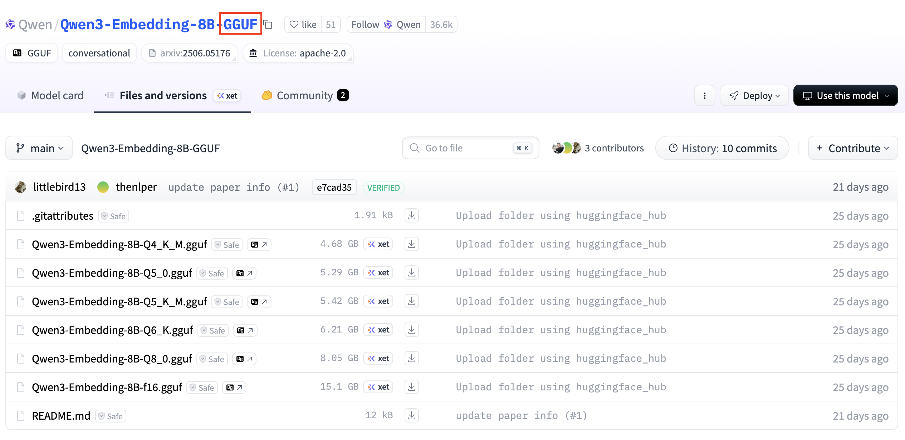
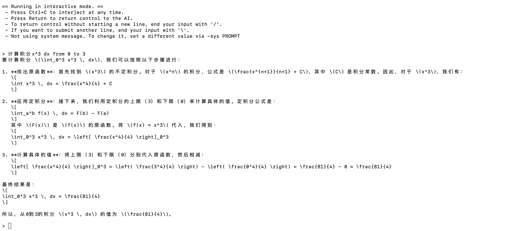

# lab4 report

## 单机部署

> 以下部署基于 MacOS 15 与 M 系列芯片的环境

通过 `homebrew` 下载 `llama.cpp` 后可直接在命令行输入 `llama-cli`、`llama-run`、`llama-simple` 指令，无需再编译并转至其他文件夹下运行。

在选择模型的时候，从`Hugging Face` 选择模型最好选择 `GGUF` 版本的（一般会在模型名称里进行标注），否则还需要使用 `llama.cpp` 提供的工具将格式转换为 `GGUF` 格式。从 `hugging face` 进行下载。



下载也可以通过点击下载按钮进行。代码如下：

```bash
pip install -U huggingface_hub
huggingface-cli download Qwen/Qwen2.5-7B-Instruct-GGUF --include "qwen2.5-7b-instruct-q5_k_m*.gguf" --local-dir <model_path> --local-dir-use-symlinks False
llama-cli -m <model_filepath>
```

一并下载一项 FP16 版本的 qwen3 8B 模型到目录下，用于性能测试的比较项目：

```bash
huggingface-cli download Qwen/Qwen3-Embedding-8B-GGUF --include "qwen3-embedding-8b-f16.gguf" --local-dir <model_path> 
```

* 当模型被划分为若干个文件时，`model_filepath` 为第1个文件路径。

完成后即可进入对话，`^+C` 退出对话。如果使用 `llama_simple` 进行运行只支持“运行->输出->退出”流程，会显示更多过程中的参数，但 `llama.cpp` 对其完善程度远不如使用 `llama_cli`。推荐运行时使用 `llama_cli`。



> 首次部署发现该模型推理时占用显存仅约 300MB，研究发现该模型经过量化后模型大小本就变为原来的 1/4，并且根据 `llama.cpp` 的优化策略发现推理时大部分未启用的内存留在了虚拟空间中并未计入系统内存。

## 分布式部署

分布式部署需要重新编译 llama.cpp 并选择 `-DGGML_RPC=ON`，由于主机和从机均没有 cuda，故不添加 `-DGGML_CUDA=ON`。

```bash
#进入llama.cpp目录下
mkdir build-rpc
cd build-rpc
cmake .. -DGGML_RPC=ON
cmake --build . --config Release
```

主机和从机都需要进行编译，等待编译完成即可。

```bash
# 在从机上启动 rpc-server 与对应后端
bin/rpc-server -p 50052
```

```bash
# 在主机上启动使用 RPC 的 llama-cli，
bin/llama-cli -m [model_path] -p [prompt] --rpc 192.168.88.10:50052,192.168.88.11:50052,...
```
