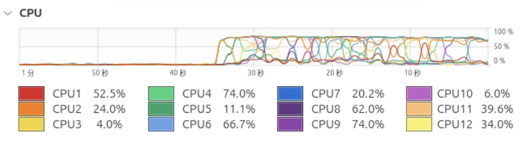

# 性能测试与优化

## LLM 部署相关的性能指标列表

|  指标  |   合理性  |
| ----- | ----- |
| **首 Token 返回延迟**：用户输入后，模型生成第一个token所需的时间 | 反应了模型部署推理参数的速度，同时能够直观体现相应速度，也能影响用户的使用体验 |
| **输出 Token 速度（Tokens/s）**：每秒输出的token数量 | 最直接体现模型推理的软件优化效率，各维度的并发的处理能力，硬件性能等 |
| **显存占用率与峰值占用**：推理中平均显存占用和最大显存占用 | 这项指标影响硬件成本，同时容易形成推理瓶颈，当显存占用过高时也会影响推理性能 |
| **错误率**：推理中报错的频率 | 从显存报错到驱动、调度器、编解码器等，任何一个错误都可能使推理意外终止，错误率也会影响推理的性能 |
| **并发吞吐量**：多请求到达时的可支持的吞吐量 | 可以稳定同时服务的用户数量也可以体现模型部署的性能，吞吐量越高部署的模型服务器可以支持更高的负载 |

## 选取测试任务

1. 评估模型在不同配置参数下的输出速度

    [https://github.com/ggml-org/llama.cpp/tree/master/tools/llama-bench](https://github.com/ggml-org/llama.cpp/tree/master/tools/llama-bench)

    仓库中含有 5 个样例测试，分别是生成固定长 tokens 的输出速度、只做 prompt encode 的输出速度、多线程下的 encode 和短 token 输出能力、GPU 和 CPU 混合推理能力、长上下文的输出速度。

2. 评估显存占用率与峰值占用

    编写 python 代码进行测试：通过不断对内存数据进行测量得到结果。

```py
import argparse
import subprocess
import time
import psutil
import statistics
import shlex
import random
from typing import Tuple, List, Optional

# 16 个预定义的 prompt
PROMPTS = [
    "你好，Llama！",
    "请用五句话总结人工智能的发展史。",
    "写一首关于夏天的短诗。",
    "解释量子纠缠的概念。",
    "给出一道中等难度的编程面试题。",
    "如何优化 Python 代码的性能？",
    "翻译以下句子：The quick brown fox jumps over the lazy dog.",
    "模拟一次简单的对话：用户问天气，系统回答。",
    "简要介绍区块链的工作原理。",
    "列举三种常见的排序算法及其时间复杂度。",
    "为新手提供一个学习机器学习的路线图。",
    "写一个 HTTP 请求的示例代码（Python）。",
    "描述一下太阳系中各行星的顺序。",
    "如何用正则表达式匹配电子邮箱？",
    "生成一段鼓励人的话。",
    "简述深度学习和传统机器学习的区别。"
]


def measure_run(cmd: str, prompt: str, interval: float) -> Optional[Tuple[float, float]]:
    """
    启动 llama-cli，将 prompt 通过 stdin 传入；采样期间每 interval 秒记录 RSS（MB）。
    若进程退出码 != 0，返回 None 表示此次测量无效。
    返回 (avg_rss_MB, peak_rss_MB)。
    """
    parts = shlex.split(cmd)
    # 启动子进程
    proc = subprocess.Popen(parts, stdin=subprocess.PIPE, stdout=subprocess.PIPE, stderr=subprocess.PIPE)
    p = psutil.Process(proc.pid)

    # 发送 prompt 并关闭 stdin
    try:
        proc.stdin.write((prompt + "\n").encode())
        proc.stdin.flush()
    except Exception:
        pass
    proc.stdin.close()

    # 采样内存
    samples: List[float] = []
    while proc.poll() is None:
        try:
            rss = p.memory_info().rss / (1024 * 1024)
            samples.append(rss)
        except (psutil.NoSuchProcess, psutil.ZombieProcess):
            break
        time.sleep(interval)

    # 等待结束并获取 stderr
    proc.wait()
    err = proc.stderr.read().decode().strip()

    if proc.returncode != 0:
        print(f"  [错误] 退出码 {proc.returncode}: {err}")
        return None

    if not samples:
        return None

    return statistics.mean(samples), max(samples)


def main():
    parser = argparse.ArgumentParser(
        description="测量 llama-cli 推理内存占用的平均值和峰值，随机使用预定义的 16 个 prompt。"
    )
    parser.add_argument("-c", "--cmd", required=True,
        help="启动 llama-cli 的命令，不含 prompt 部分，例如：\n"
             "./main -m ./models/ggml-model.bin -n 128"
    )
    parser.add_argument("-n", "--runs", type=int, default=5,
        help="重复测量次数，默认为 5"
    )
    parser.add_argument("-i", "--interval", type=float, default=0.1,
        help="内存采样间隔（秒），默认为 0.1"
    )
    args = parser.parse_args()

    avgs: List[float] = []
    peaks: List[float] = []

    print(f"开始测量：{args.runs} 次，每次间隔 {args.interval}s")
    for i in range(1, args.runs + 1):
        prompt = random.choice(PROMPTS)
        print(f"运行 {i}/{args.runs}，Prompt: {prompt} …", end=" ")

        res = measure_run(args.cmd, prompt, args.interval)
        if res is None:
            print("跳过")
            continue
        avg, peak = res
        print(f"平均 {avg:.2f} MB，峰值 {peak:.2f} MB")
        avgs.append(avg)
        peaks.append(peak)

    if not avgs:
        print("未能测量到有效的运行。请检查 llama-cli 命令和参数是否正确。")
        return

    print("\n==== 总体统计 ====")
    print(f"各次平均值的平均: {statistics.mean(avgs):.2f} MB")
    print(f"各次峰值的平均: {statistics.mean(peaks):.2f} MB")
    print(f"最大峰值:       {max(peaks):.2f} MB")

if __name__ == "__main__":
    main()
```

## 测试单机版部署

### 1. 输出速度

* 目标一：模型在生成固定长度（128/256/512 tokens）时的输出能力（tokens/sec）

* 运行方式如下

```bash
llama-bench -m <model_path> -p 0 -n 128,256,512
```

* 结果如下

| model                          |       size |     params | backend    | threads |            test |                  t/s |
| ------------------------------ | ---------: | ---------: | ---------- | ------: | --------------: | -------------------: |
| qwen2 7B Q5_K - Medium         |   5.07 GiB |     7.62 B | Metal,BLAS |      10 |           tg128 |         40.24 ± 0.04 |
| qwen2 7B Q5_K - Medium         |   5.07 GiB |     7.62 B | Metal,BLAS |      10 |           tg256 |         38.41 ± 0.13 |
| qwen2 7B Q5_K - Medium         |   5.07 GiB |     7.62 B | Metal,BLAS |      10 |           tg512 |         37.79 ± 0.18 |

> 注意到后端为 metal 和 BLAS 库，并没有显示 ngl 层数。
> 随着生成 token 数的增加，吞吐率有一定的下降但不是很明显。

* 目标二：encode 能力测试

* 运行方式如下

```bash
llama-bench -m <model_path> -p 1024 -b 256,512,1024
```

* 结果如下

| model                          |       size |     params | backend    | threads | n_batch |            test |                  t/s |
| ------------------------------ | ---------: | ---------: | ---------- | ------: | ------: | --------------: | -------------------: |
| qwen2 7B Q5_K - Medium         |   5.07 GiB |     7.62 B | Metal,BLAS |      10 |     256 |          pp1024 |        393.82 ± 1.20 |
| qwen2 7B Q5_K - Medium         |   5.07 GiB |     7.62 B | Metal,BLAS |      10 |     256 |           tg128 |         40.31 ± 0.05 |
| qwen2 7B Q5_K - Medium         |   5.07 GiB |     7.62 B | Metal,BLAS |      10 |     512 |          pp1024 |        386.74 ± 1.82 |
| qwen2 7B Q5_K - Medium         |   5.07 GiB |     7.62 B | Metal,BLAS |      10 |     512 |           tg128 |         39.99 ± 0.05 |
| qwen2 7B Q5_K - Medium         |   5.07 GiB |     7.62 B | Metal,BLAS |      10 |    1024 |          pp1024 |        385.92 ± 1.39 |
| qwen2 7B Q5_K - Medium         |   5.07 GiB |     7.62 B | Metal,BLAS |      10 |    1024 |           tg128 |         39.39 ± 0.25 |

> 随着 batch-size 的增加，相同情况下的输出速度略有下降，而仅进行 encode 的输出速度和生成固定长 token 的吞吐率差距非常大。也可以侧面说明模型处理输入的速度远高于输出的速度。
> 高 batch-size 带来的提升主要在于并发请求时的吞吐率，在单请求时可能还会略微增加延迟。

* 目标三：线程数测试

* 运行方式如下

```bash
llama-bench -m <model_path> -n 16 -p 0 -t 1,2,4,8,16
```

* 结果如下

| model                          |       size |     params | backend    | threads |            test |                  t/s |
| ------------------------------ | ---------: | ---------: | ---------- | ------: | --------------: | -------------------: |
| qwen2 7B Q5_K - Medium         |   5.07 GiB |     7.62 B | Metal,BLAS |       1 |            tg16 |         39.82 ± 0.06 |
| qwen2 7B Q5_K - Medium         |   5.07 GiB |     7.62 B | Metal,BLAS |       2 |            tg16 |         39.76 ± 0.07 |
| qwen2 7B Q5_K - Medium         |   5.07 GiB |     7.62 B | Metal,BLAS |       4 |            tg16 |         39.78 ± 0.06 |
| qwen2 7B Q5_K - Medium         |   5.07 GiB |     7.62 B | Metal,BLAS |       8 |            tg16 |         39.78 ± 0.12 |
| qwen2 7B Q5_K - Medium         |   5.07 GiB |     7.62 B | Metal,BLAS |      16 |            tg16 |         39.92 ± 0.06 |

> 从后台负载和输出速度数据可以看出，很可能测试时并没有切入真正的 CPU backend，因为并没有发现 CPU 利用率提高和 GPU 利用率降低，且输出速度随线程数无明显变化。

* 目标四：ngl 层数

* 运行方式如下：

```bash
llama-bench -m <model_path> -ngl 10,20,30,40,50 -n 512 -p 0
```

* 测试结果如下：

| model                          |       size |     params | backend    | ngl |            test |                  t/s |
| ------------------------------ | ---------: | ---------: | ---------- | ------: | --------------: | -------------------: |
| qwen2 7B Q5_K - Medium         |   5.07 GiB |     7.62 B | Metal,BLAS |      10 |           tg512 |         30.66 ± 1.82 |
| qwen2 7B Q5_K - Medium         |   5.07 GiB |     7.62 B | Metal,BLAS |      20 |           tg512 |         32.27 ± 0.65 |
| qwen2 7B Q5_K - Medium         |   5.07 GiB |     7.62 B | Metal,BLAS |      30 |           tg512 |         36.95 ± 0.12 |
| qwen2 7B Q5_K - Medium         |   5.07 GiB |     7.62 B | Metal,BLAS |      40 |           tg512 |         36.28 ± 0.37 |
| qwen2 7B Q5_K - Medium         |   5.07 GiB |     7.62 B | Metal,BLAS |      50 |           tg512 |         35.46 ± 0.25 |

> 可以认为最佳 ngl 层数在 30-40 之间。具体层数还需下一步验证。

### 2. 显存占用率与峰值占用

运行方式如下

```bash
uv run lab4/test_mem.py \
  --cmd "llama-cli --model <model_path> -n 256" \ # max_token
  --runs 16 \ # 测量间隔
  --interval 0.2 # 采样间隔
```

选取模型 qwen2.5-7b-q5_k_m 测量结果如下：

|  运行 | Prompt                                              | 平均内存 (MB) | 峰值内存 (MB) |
| :-: | :-------------------------------------------------- | --------: | --------: |
|  1  | 列举三种常见的排序算法及其时间复杂度。                                 |    339.40 |    362.39 |
|  2  | 简述深度学习和传统机器学习的区别。                                   |    341.18 |    362.36 |
|  3  | 简要介绍区块链的工作原理。                                       |    341.92 |    362.67 |
|  4  | 请用五句话总结人工智能的发展史。                                    |    317.32 |    352.12 |
|  5  | 请用五句话总结人工智能的发展史。                                    |    308.15 |    355.86 |
|  6  | 写一个 HTTP 请求的示例代码（Python）。                           |    341.84 |    363.20 |
|  7  | 简要介绍区块链的工作原理。                                       |    341.62 |    362.12 |
|  8  | 你好，Llama！                                           |    281.40 |    354.17 |
|  9  | 翻译以下句子：The quick brown fox jumps over the lazy dog. |    223.07 |    355.27 |
|  10 | 写一首关于夏天的短诗。                                         |    260.66 |    355.11 |
|  11 | 你好，Llama！                                           |    287.89 |    362.17 |
|  12 | 如何用正则表达式匹配电子邮箱？                                     |    334.28 |    356.28 |
|  13 | 列举三种常见的排序算法及其时间复杂度。                                 |    334.18 |    354.98 |
|  14 | 生成一段鼓励人的话。                                          |    320.20 |    368.45 |
|  15 | 描述一下太阳系中各行星的顺序。                                     |    342.80 |    369.67 |
|  16 | 给出一道中等难度的编程面试题。                                     |    354.12 |    375.12 |

总体统计为：

* 各次平均值的平均: 316.88 MB
* 各次峰值的平均:  360.75 MB
* 最大峰值:       375.12 MB

## 优化项目分析

### 提高输出速度

在上一节的测试中，可以发现不同参数如 batch_size, ngl 层数对输出速度起到了至关重要的作用。现给出其优化策略。

1. 确保 ngl 在 30 左右，这是最关键的参数
2. batch_size 尽量在 128-256 之间
3. 上下文长度设置为 0

经过精细测量发现 ngl=31, batch_size=128 时输出速度最大，达到 40.62 t/s。

### 最小化显存占用

1. 影响最大的是模型的选择，选择 FP16 和量化过的模型对显存占用的影响是巨大的，可以达到 1 个数量级。

2. 对于 test_mem.py 的参数进行调整在同一模型下进行实验，发现在 ngl=40 左右时最佳，batch_size 在不影响并发的情况下小一点为好，在 128 左右较为合适，上下文长度短一点为好。

### 对于所选性能指标以及 LLM 输出质量影响最大的优化操作

1. 模型选择

    对模型的选择对于各性能指标与输出质量影响巨大，特别是选择的量化版本。相比较综合下来，Q_5_K、Q_6_K 的选择在这三项中较为均衡，相较原版没有丢失太大输出质量的同时大幅降低显存要求与推理算力要求，也提升了推理速度。

2. 增大模型层数 npl

    npl 对输出速度有较大影响，根据我们的测试, 建议取 npl=30-40 之间，过小会导致输出速度下降，过大则会导致显存占用过高。

    其原因在于增加模型层数可以将更多层放在 GPU 上, 这样就可以显著减少 CPU 和 GPU 之间的数据传输，从而提高输出速度。

3. 增大批处理数量 batch_size

    batch_size 对输出速度和显存占用也有显著影响，建议在 128-256 之间选择，过小会导致 GPU 利用率不高，过大则可能导致显存不足。

    其原因在于增大 batch_size 意味着一次性将更多的数据送入 GPU 进行处理，可以充分地利用 GPU 大量的计算核心能力, 从而提升模型输出质量.

4. 增大线程数 t

    我们的测试初步表明，线程数的增大可能也对输出速度有一定的提升，但提升幅度不大，且在多线程下可能会出现线程间竞争导致的性能下降。

5. 上下文长度

    对于输出质量影响显著，在未达到训练长度时会有很大的质量损失，在达到训练长度为最优，超长上下文会导致轻微的损失，建议只要不是特别长的上下文，上下文长度长一点为好。

## 测试分布式部署

分布式部署方式详见 [lab4/deploy_report.md](./deploy_report.md)。

分布式部署的测试主要侧重于输出速度的测试，测试相同情况下使用分布式推理和单机推理的速度差距。

```bash
llama-bench -m <model_path> -p 64 -n 0 -n 512 --rpc 192.168.2.40:50052;192.168.2.40:50053
```

|             | threads |            test |                  t/s |
| ------------| ------: | --------------: | -------------------: |
| RPC         |      12 |            pp64 |         20.94 ± 0.20 |
| RPC         |      12 |           tg512 |          4.97 ± 0.01 |
| LOCAL       |      12 |            pp64 |         22.06 ± 0.60 |
| LOCAL       |      12 |           tg512 |          5.51 ± 0.04 |

> LOCAL 主机与 RPC 从机相同

```bash
llama-bench -m <model_path> -p 64 -n 0 -t 1,2,4,8,16,32 --rpc 192.168.2.40:50052;192.168.2.40:50053
```

| backend  | threads | test |   t/s     |
| ----- | ------: | ---: | -----------: |
| RPC   |       1 | pp64 | 20.19 ± 0.36 |
| RPC   |       2 | pp64 | 20.82 ± 0.56 |
| RPC   |       4 | pp64 | 20.72 ± 0.53 |
| RPC   |       8 | pp64 | 20.54 ± 0.45 |
| RPC   |      16 | pp64 | 20.12 ± 0.24 |
| RPC   |      32 | pp64 | 19.98 ± 0.26 |

可以看到使用 RPC 比本地慢! 这是有些不符合我们的预期的, 且通过性能检测器可以看到 RPC 部署时 12 个核没有全部达到 100% 利用率，而 LOCAL 部署时达到了几乎每核均在 100% 。



我们猜测原因可能在于通信开销: 在 RPC 模式下，数据需要在不同的机器之间传输，这会引入额外的延迟和带宽消耗。而在 LOCAL 模式下，所有计算都在同一台机器上进行，数据传输的开销大大减少。 

另一个可能的原因在于, 在 RPC 模式下，机器的整体输出可能受到最低性能的设备的限制。如果从机的性能较低，可能会拖慢整体速度。